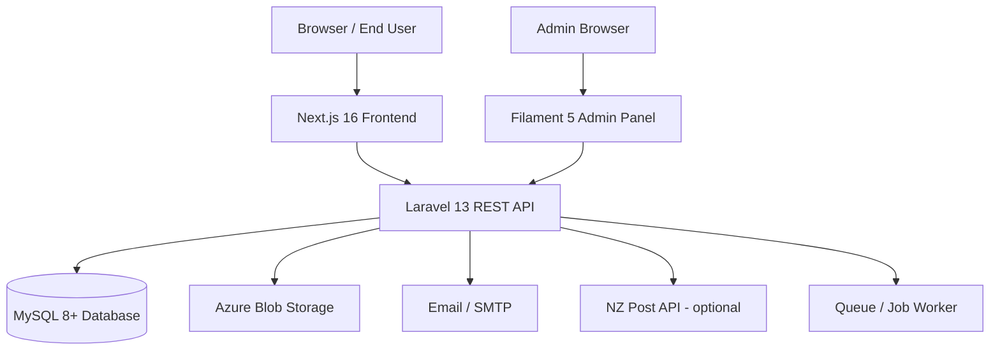
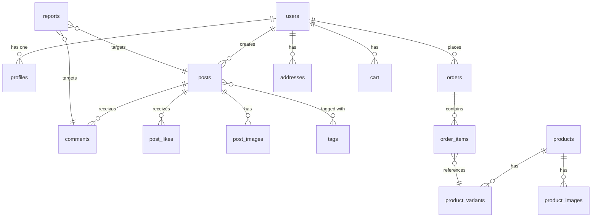
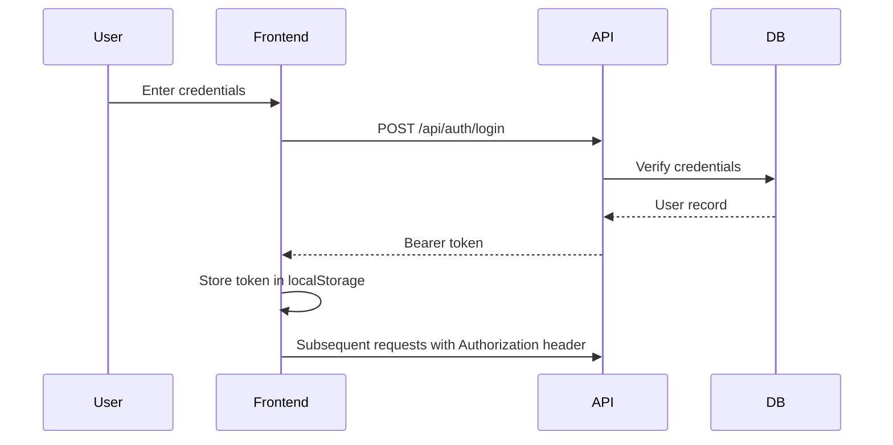

# 01 — System Architecture

## Overview

OXP follows a **decoupled, API-first architecture**. The backend exposes a RESTful JSON API consumed by the frontend. The admin panel is a server-side rendered Filament application co-located with the backend.



---

## Technology Stack

| Layer | Technology | Version |
|---|---|---|
| Backend framework | Laravel | 13 |
| Backend language | PHP | 8.2+ |
| Admin panel | Filament | 5 |
| Frontend framework | Next.js | 16 |
| Frontend language | TypeScript | 5.7 |
| UI library | React | 19 |
| CSS framework | Tailwind CSS | 4.2 |
| Component primitives | Radix UI + shadcn/ui | Latest |
| Rich text editor | Tiptap | Latest |
| Database | MySQL | 8+ |
| Storage | Azure Blob Storage (or local) | — |
| Queue | Database queue (or Redis) | — |
| Cache | Database cache (or Redis) | — |
| Authentication | Laravel Sanctum | — |
| Validation | Zod (frontend) + Laravel validator | — |

---

## Backend Structure (`B2C_backend/`)

```
B2C_backend/
├── app/
│   ├── Enums/               # 22 typed enums (UserRole, OrderStatus, etc.)
│   ├── Filament/            # Admin panel resources and pages
│   │   ├── Pages/           # 16 standalone admin pages
│   │   └── Resources/       # 33+ CRUD resource definitions
│   ├── Http/
│   │   ├── Controllers/     # 50+ API controllers
│   │   └── Middleware/      # Request middleware
│   ├── Jobs/                # Background jobs (CreateUserNotificationJob)
│   ├── Mail/                # Mail classes
│   ├── Models/              # 50+ Eloquent models
│   ├── Policies/            # 8 authorization policies
│   └── Services/            # 25+ business logic service classes
├── config/                  # Laravel configuration files
├── database/
│   ├── migrations/          # 73+ database migrations
│   └── seeders/             # Initial content seeders
├── routes/
│   ├── api.php              # All REST API routes
│   └── web.php              # Admin panel + media serving routes
└── storage/                 # File storage (local disk or linked)
```

### Key Design Decisions

- **Service layer**: All business logic is encapsulated in `app/Services/`. Controllers are thin and delegate to services.
- **Policy-based authorization**: Route middleware (`auth:sanctum`, `role:admin`, `role:moderator`) and Eloquent policies gate access.
- **Typed enums**: All status values and role types use PHP 8.1+ backed enums for type safety.
- **Settings system**: Runtime configuration is stored in the `app_settings` database table (encrypted) rather than requiring re-deployment for changes.

---

## Frontend Structure (`B2C_frontend/`)

```
B2C_frontend/
├── src/
│   ├── app/                 # Next.js App Router
│   │   └── [locale]/        # Locale-prefixed routes (en, ko, zh)
│   ├── components/          # React components
│   │   ├── account/         # Account page components
│   │   ├── articles/        # Article display
│   │   ├── auth/            # Authentication components
│   │   ├── community/       # Community feature components
│   │   ├── legal/           # Legal page wrappers
│   │   ├── sections/        # Homepage section components
│   │   ├── store/           # Store and checkout components
│   │   └── ui/              # shadcn/ui primitives
│   └── lib/
│       ├── api/             # Backend API client modules
│       ├── auth/            # Auth state management
│       ├── cart/            # Cart state management
│       ├── hooks/           # Custom React hooks
│       ├── i18n.ts          # i18n configuration
│       └── types.ts         # TypeScript type definitions
├── messages/
│   ├── en.json              # English translations (~95 KB)
│   ├── ko.json              # Korean translations (~105 KB)
│   └── zh.json              # Chinese translations (~89 KB)
└── public/                  # Static assets
```

### Routing

All public pages are nested under `[locale]` to support language switching. The locale is resolved from the URL path and defaults to `en`.

Example routes:
- `/en/store` → English store
- `/ko/community` → Korean community hub
- `/zh/account/orders` → Chinese order history

Authentication uses **localStorage token storage** (`oxp.community.auth-token`) via Laravel Sanctum bearer tokens.

---

## Admin Panel Structure

The admin panel is accessible at `/admin` (backend URL). It is built with Filament 5.

### Navigation Groups

| Group | Resources / Pages |
|---|---|
| **Community** | Posts, Comments, Reports, Moderation Log, User Violations, Admin Action Log |
| **Users** | Users |
| **Store** | Orders, Products, Product Variants, Product Categories, Product Images, Attributes, Inventory, Carts, Addresses |
| **CMS** | Materials, Material Specs, Story Sections, Applications, Articles, Homepage Sections, Idea Media |
| **B2B / Leads** | B2B Leads, Enquiries |
| **Email** | Email Templates, Email Events, Email Logs |
| **Funding** | Funding Campaigns |
| **Community Settings** | Categories, Tags |
| **System** | Application Settings, Feature Flags, Community Settings, Moderation Settings, Email Settings, Shipping Settings, Tax Settings, Storage Settings, NZ Post Settings, Legal Page Settings, Settings Backup, Media Storage Scan, Handover Readiness |

---

## Database Architecture

### Core Relationships



### Key Tables

| Table | Purpose |
|---|---|
| `users` | Core user accounts (role, account_status, banned flags) |
| `profiles` | Extended user profiles (bio, avatar, location) |
| `posts` | Community posts with engagement scoring |
| `comments` | Nested comments (parent_id for threading) |
| `products` | Product catalog with localized content |
| `product_variants` | SKU-level variants with stock quantities |
| `orders` | Orders with full status lifecycle |
| `order_items` | Line items linked to product variants |
| `carts` / `cart_items` | Shopping cart state |
| `materials` | Material library with multilingual content |
| `articles` | Knowledge base articles |
| `home_sections` | Configurable homepage sections |
| `app_settings` | Encrypted runtime configuration values |
| `b2b_leads` | Structured B2B inquiry records |
| `reports` | Polymorphic content reports |
| `moderation_logs` | Admin moderation audit trail |
| `email_templates` | Transactional email templates |
| `email_logs` | Email delivery records |

---

## Authentication & Authorization

### Authentication Flow



### Role Model

| Role | Code | Capabilities |
|---|---|---|
| **Regular User** | `creator` | Browse, post, comment, shop, report |
| **Moderator** | `moderator` | All user capabilities + review reports, moderate posts/comments |
| **Administrator** | `admin` | Full access to admin panel and all API endpoints |

### Account Status

| Status | Meaning |
|---|---|
| `active` | Normal account |
| `suspended` | Temporarily disabled, cannot log in |
| `banned` | Permanently banned |
| `restricted` | Can log in but cannot post or comment |

---

## Service Classes

| Service | Responsibility |
|---|---|
| `AuthService` | Registration, login, password reset, email verification |
| `PostService` | Post CRUD, status transitions, content validation |
| `CommentService` | Comment management and threading |
| `InteractionService` | Likes, favorites, follows |
| `NotificationService` | Notification creation and delivery |
| `PostRankingService` | Engagement and trending score calculation |
| `SearchService` | Full-text search across posts, materials, articles |
| `ReportService` | Content report submission and resolution workflow |
| `AdminModerationService` | Admin moderation actions (hide, warn, restrict, ban) |
| `GovernanceService` | User violation recording and governance audit |
| `OrderService` | Order creation, status updates, guest order lookup |
| `CartService` | Cart management, item operations, cart merging |
| `ProductCatalogService` | Product listing, filtering, and search |
| `MediaService` | File upload, validation, and deletion |
| `InquiryService` | B2B lead and inquiry capture |
| `B2BLeadService` | Lead qualification and status management |
| `FundingCampaignService` | Funding campaign logic |
| `ContentManagementService` | CMS operations (articles, materials, homepage sections) |

---

## Storage & Media

- **Default production disk**: Azure Blob Storage (`azure` driver)
- **Community uploads**: Stored on `COMMUNITY_UPLOAD_DISK` (defaults to same as `FILESYSTEM_DISK`)
- **Local fallback**: `public` disk with `php artisan storage:link` for development
- **Media file metadata**: Stored in `media_files` table with disk, path, MIME type, and size
- **SAS URL generation**: Azure Blob Storage URLs use time-limited SAS tokens (default TTL: 7 days / 10080 minutes)
- **File size limits**: Up to 10 MB per file (configurable via `IDEA_MEDIA_MAX_FILE_SIZE_KB`)
- **Allowed types**: Images (jpg, jpeg, png, webp, gif), Documents (pdf, doc, docx, ppt, pptx, xls, xlsx)
- **Maximum files per post**: 12 files + 4 external links

*Related code: `app/Services/MediaService.php`, `app/Services/MediaFileService.php`*

---

## Email System

The platform includes a complete email center:

- **Email templates**: Stored in `email_templates` table with localized content
- **Email events**: Defined in `email_events` table (e.g., `order.created`, `order.status_changed`, `order.shipped`)
- **Email logs**: All sent emails are recorded in `email_logs`
- **Mail driver**: Configured via `MAIL_MAILER` environment variable (defaults to `log` in development)
- **B2B lead notification**: `B2BLeadSubmittedMail` notifies admins when a new B2B lead is received
- **Template-based dispatch**: `GenericEmailMessage` renders templates with variable substitution

*Related code: `app/Mail/`, `app/Models/EmailTemplate.php`, `app/Models/EmailLog.php`*

---

## i18n Architecture

### Frontend
- Translation files: `B2C_frontend/messages/{locale}.json`
- Locale routing: `[locale]` segment in Next.js App Router
- Custom i18n implementation: `B2C_frontend/lib/i18n.ts`
- Build-time validation: `check:i18n` script validates key coverage across locales

### Backend
- Multilingual content fields: Products, materials, articles, home sections, and categories all include localized text columns (e.g., `name_en`, `name_ko`, `name_zh`)
- API response locale selection based on request headers or query parameters
- Admin panel locale switching: `GET /admin/locale/{locale}`

---

## Queue & Background Jobs

- **Queue driver**: Database (configurable to Redis)
- **Jobs**: `CreateUserNotificationJob` — creates user notifications asynchronously
- **Queue worker**: Must be running for notifications to be delivered promptly
- **Scheduler**: No scheduled tasks are configured beyond the standard Laravel scheduler

---

## Environment Configuration Overview

See [10-settings-and-configuration.md](./10-settings-and-configuration.md) for the full environment variable reference.

Key categories:
- `APP_*` — Application identity and environment
- `DB_*` — Database connection
- `FILESYSTEM_DISK`, `AZURE_*` — Storage backend
- `MAIL_*` — Email delivery
- `SANCTUM_*`, `FRONTEND_URL`, `CORS_*` — Frontend/API trust
- `STORE_*` — Commerce configuration (currency, tax, shipping rates)
- `NZPOST_*` — NZ Post shipping integration
- `COMMUNITY_*` — Community feature toggles

---

## Error Handling & Logging

- **Log channel**: Configured via `LOG_CHANNEL` (default: `stack` / `single` file)
- **Log level**: `LOG_LEVEL=debug` in development, `error` recommended for production
- **HTTP errors**: Laravel's exception handler returns JSON responses for API requests
- **Frontend errors**: Sonner toast notifications for user-facing errors; console logging in development
- **Failed jobs**: Tracked in `failed_jobs` table; visible in admin handover readiness page

---

*Related code: `B2C_backend/app/`, `B2C_frontend/`, `B2C_backend/routes/`*
