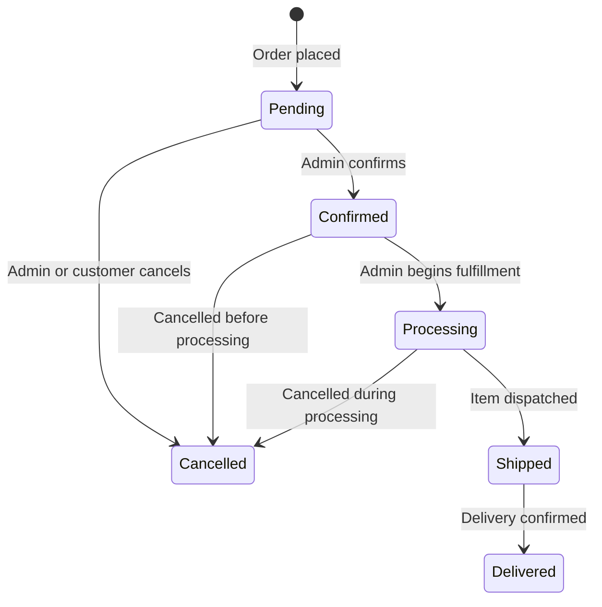
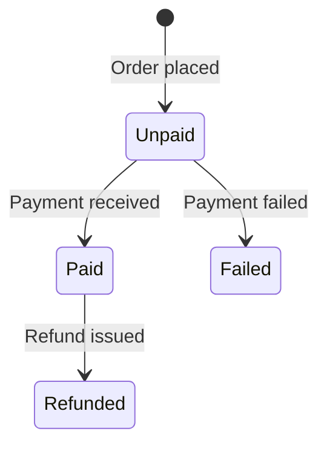

# 04 — Store Manual

## Overview

The OXP store is a full B2C e-commerce module supporting product browsing, cart management, checkout, and order tracking. It supports both **guest checkout** and **authenticated user checkout**.

*Related code: `B2C_backend/app/Models/Product.php`, `OrderService.php`, `CartService.php`*

---

## 1. Product Catalog

### 1.1 Product Data Structure

Each product contains the following fields:

**Identity**
- `name` — multilingual (EN / KO / ZH)
- `slug` — unique URL identifier
- `status` — Active, Inactive, Draft, Archived

**Content**
- `description` — rich text, multilingual
- `features` — feature list, multilingual
- `care_instructions` — multilingual
- `material_benefits` — multilingual
- `certifications` — certification text
- `shipping_notes` — multilingual
- `return_notes` — multilingual
- `product_faqs` — JSON array of FAQ items (question / answer, multilingual)

**Commerce**
- `price` — decimal, in NZD
- `compare_at_price` — original price for sale display
- `inquiry_only` — boolean; if true, product cannot be added to cart
- `sample_request_enabled` — boolean; allows sample requests
- `is_featured` — boolean; shown in featured product sections

**SEO**
- `seo_title` — multilingual
- `seo_description` — multilingual

**Relationships**
- Belongs to one `ProductCategory`
- Has many `ProductVariant`
- Has many `ProductImage`
- Has many `ProductAttributeAssignment` (dynamic attributes)

*Related code: `app/Models/Product.php`, `database/migrations/..._create_product_catalog_tables.php`*

### 1.2 Product Categories

Products are organized by categories. Categories support:
- Name (multilingual: EN / KO / ZH)
- Slug (unique URL identifier)
- Parent category (for hierarchy)
- Demo content flag

### 1.3 Product Variants

Each product can have one or more variants representing specific purchasable units (e.g., different sizes):

| Field | Description |
|---|---|
| `sku` | Stock Keeping Unit — unique identifier per variant |
| `stock_quantity` | Current available inventory |
| `weight_grams` | Package weight for shipping calculations |
| `barcode` | Barcode / GTIN (optional) |

Variants are what gets added to the cart and ordered. Stock is tracked at the variant level.

### 1.4 Dynamic Product Attributes

The platform supports a flexible attribute system via three tables:
- `product_attribute_definitions` — defines attribute types (e.g., "Color", "Size")
- `product_attribute_values` — defines attribute values (e.g., "Red", "Medium")
- `product_attribute_assignments` — links products to their attribute values

This allows the product catalog to accommodate any attribute combination without schema changes.

*Related code: `app/Models/ProductAttributeDefinition.php`, `database/migrations/..._create_product_attribute_tables.php`*

---

## 2. Cart Behavior

### 2.1 Cart Storage

- Each authenticated user has one cart record in the `carts` table.
- Guest carts are stored as session data in the browser.
- When a guest logs in, their guest cart is **merged** with their account cart via `POST /api/cart/merge`.

### 2.2 Cart Operations

| Operation | API Endpoint |
|---|---|
| View cart | `GET /api/cart` |
| Add item | `POST /api/cart/items` |
| Update quantity | `PATCH /api/cart/items/{id}` |
| Remove item | `DELETE /api/cart/items/{id}` |
| Clear cart | `DELETE /api/cart` |
| Merge guest cart | `POST /api/cart/merge` |

### 2.3 Cart Item Data

Each cart item records:
- Product variant reference
- Quantity
- Price at time of adding (snapshot)

### 2.4 Stock Validation

When an item is added to the cart or the cart is updated, the system checks that the requested quantity does not exceed available stock. If insufficient stock is available, an error is returned.

*Related code: `app/Services/CartService.php`, `app/Models/Cart.php`, `app/Models/CartItem.php`*

---

## 3. Checkout Behavior

### 3.1 Guest Checkout

Guest checkout allows users to place orders without an account:
1. User provides an **email address** for order confirmation and tracking.
2. User enters shipping address details.
3. User selects a shipping method.
4. User places the order.

The order is associated with the guest email address. A guest can look up their order using the order number and email via `GET /api/orders/guest/{orderNumber}`.

*Related code: `database/migrations/..._add_guest_shipping_tax_fields_to_orders_table.php`*

### 3.2 Authenticated User Checkout

Logged-in users can:
1. Use a **saved address** from their address book.
2. Enter a new address (optionally saved to their address book).
3. Select a shipping method.
4. Place the order.

### 3.3 Shipping Options

The platform supports two modes for shipping rates:

**Flat-rate mode (default):**
Shipping rates are configured in the admin panel:
- Standard shipping: `STORE_STANDARD_SHIPPING_RATE` (default NZD 8)
- Express shipping: `STORE_EXPRESS_SHIPPING_RATE` (default NZD 14)
- Rural surcharge: `STORE_RURAL_SHIPPING_SURCHARGE` (default NZD 5)
- Free shipping threshold: `STORE_FREE_SHIPPING_THRESHOLD` (default NZD 200)

**NZ Post integration (optional):**
When `NZPOST_ENABLED=true` and credentials are configured, real-time shipping quotes are fetched from NZ Post. The selected quote is stored as a JSON snapshot in the order.

*Related code: `app/Http/Controllers/Api/StoreShippingController.php`, `config/store.php`*

### 3.4 Tax Handling

- GST rate: `STORE_GST_RATE` (default 15%)
- `STORE_PRICES_INCLUDE_GST=true` means product prices are displayed GST-inclusive.
- Tax is calculated and stored on the order.

### 3.5 Payment

> **Important**: The OXP platform does not include a connected payment gateway. The order is placed with a `payment_status` of `unpaid`. Payment processing must be configured separately by the operator.

The order stores:
- `payment_method` — method entered at checkout
- `payment_reference` — reference number from payment processor
- `payment_status` — Unpaid / Paid / Refunded / Failed

---

## 4. Order Creation

When a user places an order:
1. `OrderService::create()` is called.
2. An order number is generated: `OXP-` + 6 random uppercase alphanumeric characters.
3. A shipping address snapshot is stored with the order (in case the user later changes their address).
4. The shipping quote is stored as a JSON snapshot.
5. Order items are created with price snapshots from the product variants.
6. The cart is cleared.
7. The order status is set to `Pending`.

*Related code: `app/Services/OrderService.php`, `app/Models/Order.php`*

---

## 5. Order Status Lifecycle

Each status transition is timestamped:
- `confirmed_at`
- `processing_at`
- `shipped_at`
- `delivered_at`
- `cancelled_at`

### Payment Status Lifecycle

---

## 6. Admin Order Processing

Administrators process orders via the admin panel (**Store → Orders**):

1. **Review** the new order.
2. **Confirm** the order — update status to Confirmed.
3. **Process** the order — prepare and package the item.
4. **Ship** the order — enter tracking information and update status to Shipped.
5. **Mark Delivered** when delivery is confirmed.

For cancellations: update the status to Cancelled, and manually process any refunds through the payment processor.

---

## 7. Guest Order Lookup

Guests who placed orders without an account can look up their orders:

- **Frontend route**: `/store/orders`
- **Required information**: Order number (OXP-XXXXXX) and the email address used at checkout.
- The system verifies both match before showing the order.

*Related code: `app/Http/Controllers/Api/OrderController.php::lookupGuest()`*

---

## 8. Address Management

Registered users can maintain an address book:
- Add new addresses with full shipping details
- Set a default address
- Edit existing addresses
- Delete addresses

At checkout, the saved default address is pre-filled.

---

## 9. Inventory Handling

- Stock is tracked per **product variant** via the `stock_quantity` field.
- When an order is placed, stock is **not automatically decremented** in the current implementation — inventory adjustments are manual via the admin panel.
- The `InventoryAdjustment` model tracks manual stock changes with notes.

> **Recommendation**: Establish a regular process to manually adjust inventory quantities after fulfilling orders.

*Related code: `app/Models/InventoryAdjustment.php`, `app/Filament/Resources/InventoryResource.php`*

---

## 10. Current Store Limitations

| Limitation | Detail |
|---|---|
| No payment gateway | Orders are placed without payment processing; requires manual payment confirmation |
| Manual inventory management | Stock levels must be manually updated by admins |
| NZ-centric shipping | Built for New Zealand Post; international shipping not configured |
| No discount/coupon system | No promotional discount or coupon code functionality |
| No wishlist | No separate wishlist feature (favorites are for community posts) |
| No product reviews | No customer review or rating system |
| Single currency | NZD only |

---

*Related code: `B2C_backend/app/Services/OrderService.php`, `B2C_backend/app/Services/CartService.php`, `B2C_frontend/src/components/store/`*
