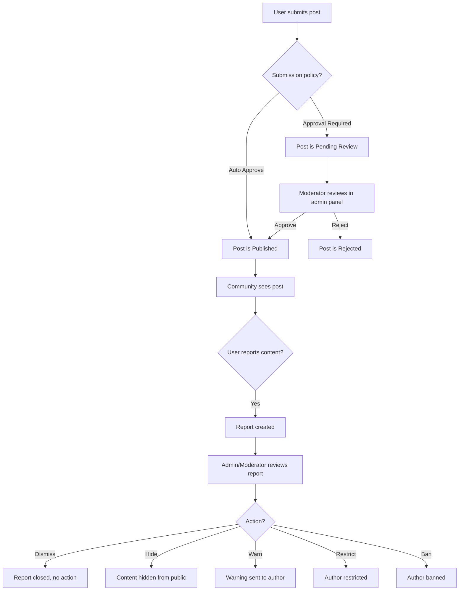

# 05 — Community Manual

## Overview

The OXP community is a user-generated content hub where registered users can share ideas, projects, and knowledge related to sustainable materials and design. It functions similarly to a specialized social publishing platform.

*Related code: `B2C_backend/app/Services/PostService.php`, `B2C_frontend/src/components/community/`*

---

## 1. Community Purpose

The community is designed to:
- Encourage knowledge sharing among material innovators and designers
- Provide a space for project showcases and idea pitching
- Enable discovery of community members through follow relationships
- Allow users to support funding campaigns attached to posts
- Maintain quality content through a moderation and reporting system

---

## 2. User-Generated Posts

### 2.1 Post Fields

| Field | Required | Description |
|---|---|---|
| `title` | Yes | Post headline |
| `content` | Yes | Rich text body (stored as JSON via Tiptap) |
| `excerpt` | No | Auto-generated or manually set summary |
| `cover_image` | No | Header image |
| `category` | No | Post category for filtering |
| `tags` | No | Multiple tags for discoverability |
| `reading_time` | Auto | Estimated reading time in minutes |
| `status` | Auto | Draft / Published / Pending Review / Archived / Rejected |
| `is_featured` | Admin | Whether the post appears in featured sections |
| `is_pinned` | Admin | Whether the post is pinned to the top of the feed |
| `is_demo_content` | System | Marks demo/seeder content |
| `published_at` | Auto | Timestamp when the post went live |

### 2.2 Rich Text Content

Post content uses the **Tiptap** rich text editor. Users can:
- Apply heading styles (H1, H2, H3)
- Bold, italic, and underline text
- Create ordered and unordered lists
- Add hyperlinks
- Insert images inline
- Add code blocks with syntax highlighting
- Use blockquotes

Content is stored as JSON (`content_json`) and rendered on the frontend by `PostRenderer.tsx`.

*Related code: `B2C_frontend/src/components/community/RichPostEditor.tsx`*

### 2.3 Submission Policy

The platform supports three community submission policies (configurable by admins):

| Policy | Behavior |
|---|---|
| **Auto Approve** | Posts go live immediately after submission |
| **Approval Required** | Posts enter "Pending Review" status and must be approved by a moderator |
| **Restricted** | Only certain users can post (users must be whitelisted) |

*Related code: `app/Enums/CommunitySubmissionPolicy.php`, `app/Models/CommunityModerationSetting.php`*

---

## 3. Media Attachments (Idea Media)

Posts can have rich media attachments stored in the `idea_media` table:

| Field | Description |
|---|---|
| `kind` | Image, Document, or Link |
| `type` | Internal (uploaded) or External (URL) |
| `source_type` | Upload, URL, or Integration |
| `sort_order` | Display order |

**Limits per post:**
- Maximum **12 files** (images and documents)
- Maximum **4 external links**
- Maximum file size: **10 MB** per file (configurable via `IDEA_MEDIA_MAX_FILE_SIZE_KB`)
- Allowed image types: jpg, jpeg, png, webp, gif
- Allowed document types: pdf, doc, docx, ppt, pptx, xls, xlsx

*Related code: `app/Models/IdeaMedia.php`, `app/Enums/IdeaMediaKind.php`*

---

## 4. Post Interactions

### 4.1 Likes

- Users can **like** any published post by clicking the like button.
- Liking is toggled (click again to unlike).
- Like counts are publicly visible.
- Likes contribute to the post's `engagement_score`.

*Related code: `app/Models/PostLike.php`, `app/Http/Controllers/Api/PostLikeController.php`*

### 4.2 Saves / Favorites

- Users can **save** a post to their personal reading list by clicking the bookmark icon.
- Saved posts are accessible from **Account → Community → Saved**.
- Saves do not affect the public like count.

*Related code: `app/Models/Favorite.php`, `app/Http/Controllers/Api/FavoriteController.php`*

### 4.3 Comments

- Any authenticated user can comment on a published post.
- Comments support **threaded replies** (one level deep via `parent_id`).
- Comment depth is tracked for display purposes.
- Comments can be liked independently of the post.

*Related code: `app/Models/Comment.php`, `app/Http/Controllers/Api/CommentController.php`*

---

## 5. Follow Relationships

Users can follow other users:
- Click **Follow** on a user's profile page.
- Followers and following counts are shown on profiles.
- Following relationships use the `follows` table (self-referential: `follower_id` ↔ `following_id`).

Access follower / following lists from:
- User public profiles: `/community/profile/{username}`
- Account section: `Account → Community → Followers` / `Account → Community → Following`

*Related code: `app/Models/Follow.php`, `app/Http/Controllers/Api/FollowController.php`*

---

## 6. Notifications

Users receive in-platform notifications for:

| Notification Type | Trigger |
|---|---|
| `post_like` | Someone liked your post |
| `comment` | Someone commented on your post |
| `comment_like` | Someone liked your comment |
| `follow` | Someone followed you |
| `report` | A report on your content has been resolved |
| `system_announcement` | Admin broadcast announcement |

Notifications are created asynchronously via the `CreateUserNotificationJob` background job.

Notifications appear in the **notification bell** in the top navigation. Users can mark individual notifications as read or mark all as read.

*Related code: `app/Jobs/CreateUserNotificationJob.php`, `app/Models/UserNotification.php`*

---

## 7. Funding Campaigns

Posts can optionally be linked to a **funding campaign**:
- A campaign is associated with a post and displays a support button.
- The button text is configurable (default: "Support this concept").
- Campaign content includes localized title, description, and support button text.
- Campaign status: Active, Inactive, Completed, or Cancelled.

> **Current limitation**: Funding campaign display on the frontend is limited. The data model and admin management are complete, but the frontend rendering of campaign progress is minimal.

*Related code: `app/Models/FundingCampaign.php`, `app/Filament/Resources/FundingCampaignResource.php`*

---

## 8. Search

The community search allows users to find posts by keyword:
- `GET /api/search` — global search
- `GET /api/search/posts` — post-specific search

Search results are returned with relevance ranking.

*Related code: `app/Services/SearchService.php`, `app/Http/Controllers/Api/SearchController.php`*

---

## 9. Post Ranking

Community posts are ranked by two computed scores:

**Engagement Score** (`engagement_score`): Based on likes, comments, saves, and views. Updated when interactions occur.

**Trending Score** (`trending_score`): A time-weighted combination of recent engagement. Used to surface trending posts.

*Related code: `app/Services/PostRankingService.php`*

---

## 10. Reporting Content

Any authenticated user can report content they find inappropriate:

1. Click the **three-dot menu** (⋮) on a post or comment.
2. Select **Report**.
3. Choose a report reason from the dropdown.
4. Optionally add additional details.
5. Submit.

Reports are reviewed by moderators and administrators in the admin panel.

### Report Target Types
- Post
- Comment

### Report Reasons (mapped to violation types)
- Harassment
- Hate speech
- Spam
- Misinformation
- Copyright violation
- Other

*Related code: `app/Models/Report.php`, `app/Services/ReportService.php`*

---

## 11. User Profiles (Public)

Public user profiles are accessible at `/community/profile/{username}`. Profiles show:
- Display name, username, avatar
- Bio and location
- Verified status badge (if `is_verified` = true)
- Follower / following counts
- User's published posts
- Follow / unfollow button

*Related code: `B2C_frontend/src/components/community/community-profile-page.tsx`*

---

## 12. Moderation Flow (Community)

---

## 13. Restricted and Banned Users

**Restricted users**:
- Can log in and view content
- Cannot create new posts or comments
- Cannot like or interact with content

**Suspended users**:
- Cannot log in at all

**Banned users**:
- Permanent account lock
- Cannot log in

Account status is checked on every API request by middleware.

*Related code: `app/Http/Middleware/`, `app/Enums/AccountStatus.php`*

---

## 14. Admin Community Controls

From the admin panel, administrators can:

- **Moderate the queue**: Review pending reports (`Community → Reports`)
- **Feature/unfeature posts**: Mark posts as featured for homepage display
- **Pin posts**: Pin posts to the top of the feed
- **Archive posts**: Remove from public feed without deleting
- **Manage categories and tags**: Create, edit, delete taxonomy
- **Adjust ranking formula**: Configure engagement scoring weights
- **Create announcements**: Send system-level notifications to all users

---

## 15. Current Community Limitations

| Limitation | Detail |
|---|---|
| Funding campaign frontend | Limited display of campaign progress on the frontend |
| No real-time updates | Feed does not auto-refresh without page reload |
| No direct messaging | No private message system between users |
| No post scheduling | Posts are published immediately (no future scheduling) |
| Rich text image uploads | Inline image uploads in rich text content depend on media storage being configured |

---

*Related code: `B2C_backend/app/Services/PostService.php`, `B2C_backend/app/Models/Post.php`, `B2C_frontend/src/components/community/`*
