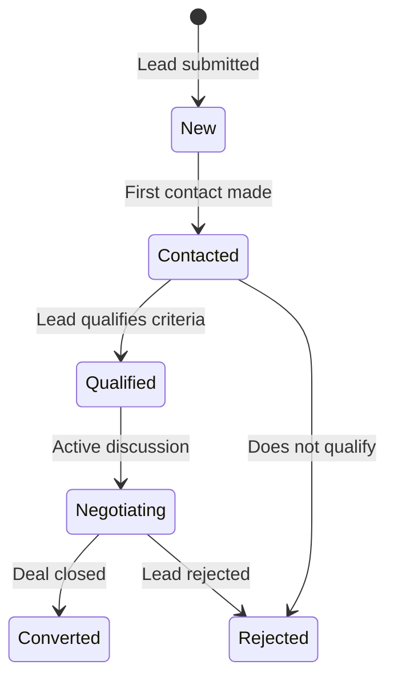

# 06 — B2B and Contact Manual

## Overview

The OXP platform provides several mechanisms for businesses and individuals to reach out for professional inquiries, partnership discussions, material requests, and collaborations. All submissions are stored in the database and managed through the admin panel.

---

## 1. Inquiry Types

| Form Type | Endpoint | Database Model | Purpose |
|---|---|---|---|
| General Inquiry | `POST /api/inquiries` | `Inquiry` | General contact / questions |
| Business Contact | `POST /api/business-contacts` | `Inquiry` (BusinessContact type) | Business partnership initial contact |
| B2B Inquiry | `POST /api/partnership-inquiries` | `B2BLead` | Structured B2B lead form |
| University Collaboration | `POST /api/university-collaborations` | `PartnershipInquiry` | Academic / university partnerships |
| Product Development | `POST /api/product-development-collaborations` | `PartnershipInquiry` | Product development partnerships |
| Material Request | `POST /api/sample-requests` | `SampleRequest` | Request product review packs |

---

## 2. B2B Inquiry Form (User-Facing)

**Frontend location**: `/b2b` or accessed from the B2B section of the homepage.

### 2.1 Form Fields

The structured B2B inquiry form captures:

**Contact Information**
- First name and last name
- Email address
- Phone number (optional)
- Country

**Company Information**
- Company name
- Company size (Small <50 / Medium 50-500 / Large 500+)
- Industry
- Annual production volume (if applicable)

**Inquiry Details**
- Lead type: Material Inquiry / Partnership / Material Request / Collaboration
- Interest type: Wholesale / Distribution / Manufacturing / Custom Production / Training
- Message / description of needs

### 2.2 Submission Behavior

When the form is submitted:
1. A new `B2BLead` record is created in the database.
2. Status is set to `new`.
3. If `B2B_LEADS_NOTIFY_ADMINS=true` is configured, a notification email is sent to `B2B_LEAD_NOTIFICATION_RECIPIENTS`.
4. A success message is shown to the user.

*Related code: `app/Http/Controllers/Api/PartnershipInquiryController.php`, `app/Services/B2BLeadService.php`, `app/Mail/B2BLeadSubmittedMail.php`*

---

## 3. Contact Form (User-Facing)

**Frontend location**: `/contact`

A simpler general contact form for non-business inquiries:
- Name
- Email address
- Subject
- Message

Submissions are stored as `Inquiry` records and visible in the admin panel under **B2B / Leads → Enquiries**.

*Related code: `app/Http/Controllers/Api/InquiryController.php`, `app/Models/Inquiry.php`*

---

## 4. Material Request Form

Accessible when a product has `sample_request_enabled = true`.

Fields:
- Contact name and email
- Product of interest
- Intended use / description
- Quantity requested

Submissions are stored as `MaterialRequest` records.

*Related code: `app/Http/Controllers/Api/MaterialRequestController.php`*

---

## 5. Backend Storage

All inquiry types are stored in the database and never lost. The following models hold inquiry data:

| Model | Table | Description |
|---|---|---|
| `Inquiry` | `inquiries` | General and business contact inquiries |
| `B2BLead` | `b2b_leads` | Structured B2B leads with full qualification data |
| `PartnershipInquiry` | `partnership_inquiries` | Partnership and collaboration requests |
| `SampleRequest` | `sample_requests` | Material requests |

The `B2BLead` model contains the richest data structure, including structured fields for:
- Company size
- Industry
- Production volume
- B2B type (lead type)
- B2B interest type
- Lead status and pipeline tracking

---

## 6. Admin Review Flow

### 6.1 Viewing B2B Leads

**Location**: Admin Panel → B2B / Leads → B2B Leads

The lead list shows:
- Company name and contact information
- Lead type (Material Inquiry / Partnership / Material Request / Collaboration)
- Interest type
- Status (New / Contacted / Qualified / Negotiating / Converted / Rejected)
- Date received

### 6.2 Lead Status Pipeline

### 6.3 Processing a Lead

1. Open the lead record.
2. Review the submitted information (company, contact, interest type, message).
3. Update the **status** to reflect your current engagement stage.
4. Optionally assign the lead to a team member using the **Assigned To** field.
5. Add internal notes.
6. Save changes.

### 6.4 Exporting Leads

Click the **Export** button from the B2B Leads list to download a CSV file containing all leads. Useful for:
- CRM import
- Reporting
- Sales pipeline tracking

The export endpoint is also accessible via: `GET /api/admin/b2b-leads/export`

*Related code: `app/Http/Controllers/Api/Admin/B2BLeadController.php`*

---

## 7. Viewing General Enquiries

**Location**: Admin Panel → B2B / Leads → Enquiries

General inquiries and business contact submissions appear here. Each record shows:
- Submitter name and email
- Subject / inquiry type
- Message content
- Submission date
- Assigned to (if applicable)

---

## 8. Email Notification Flow

When `B2B_LEADS_NOTIFY_ADMINS=true`:
1. A B2B inquiry is submitted.
2. The system creates the lead record.
3. A `B2BLeadSubmittedMail` email is dispatched.
4. The email is sent to all addresses in `B2B_LEAD_NOTIFICATION_RECIPIENTS` (comma-separated list).
5. The email is logged in `email_logs`.

To configure:
- Set `B2B_LEADS_NOTIFY_ADMINS=true` in the `.env` file.
- Set `B2B_LEAD_NOTIFICATION_RECIPIENTS=admin@company.com,sales@company.com`.
- Ensure the mail server is properly configured.

*Related code: `app/Mail/B2BLeadSubmittedMail.php`*

---

## 9. Recommended Workflow for Administrators

1. **Check daily** for new B2B leads in the admin panel.
2. **Respond within 24–48 hours** of lead submission to maximize conversion.
3. **Update lead status** after each interaction to maintain an accurate pipeline view.
4. **Use the export** function monthly for sales reporting and CRM sync.
5. **Configure email notifications** so the sales team is alerted immediately on new submissions.
6. **Assign leads** to specific team members to track accountability.

---

## 10. Current Limitations

| Limitation | Detail |
|---|---|
| No automated CRM sync | Leads must be exported manually and imported to a CRM |
| No lead scoring | No automated qualification scoring; all assessment is manual |
| No email reply threading | Replies to lead emails are not tracked in the platform |
| No internal chat / notes | Notes are a single text field; no threaded internal conversation |

---

*Related code: `B2C_backend/app/Models/B2BLead.php`, `B2C_backend/app/Services/B2BLeadService.php`, `B2C_frontend/components/sections/b2b-inquiry-form.tsx`*
