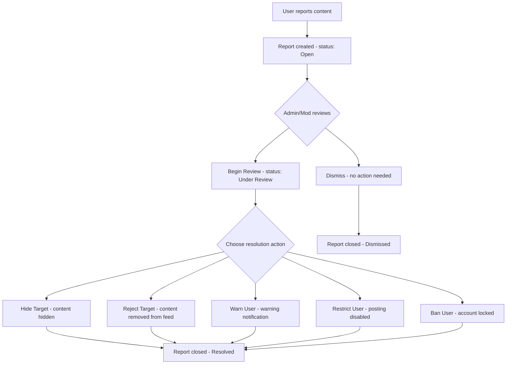

# 09 — Moderation and Reporting

## Overview

The OXP platform includes a comprehensive community moderation system to maintain content quality and user safety. This manual covers the full moderation workflow from report submission to resolution.

*Related code: `app/Services/ReportService.php`, `app/Services/AdminModerationService.php`, `app/Services/GovernanceService.php`*

---

## 1. Moderation Architecture

---

## 2. Report Management

### 2.1 Accessing Reports

**Location**: Admin Panel → Community → Reports

The reports list shows all content reports with:
- Reporter (username)
- Target type (Post or Comment)
- Target content preview
- Report status
- Submission date

**Filters available:**
- Status: Open / Under Review / Resolved / Rejected / Dismissed
- Target type: Post / Comment
- Date range

### 2.2 Report Fields

| Field | Description |
|---|---|
| `reporter` | User who submitted the report |
| `reportable_type` | Post or Comment |
| `reportable_id` | ID of the reported item |
| `status` | Open / Under Review / Resolved / Rejected / Dismissed |
| `resolution_action` | Hide / Delete / Warn / Restrict / Ban (set on resolution) |
| `feedback` | Message shown to the reporter after resolution |
| `rejected_reason` | Reason if the report was rejected (content is fine) |
| `resolved_at` | Timestamp when resolved |
| `feedback_given_at` | Timestamp when feedback was sent to reporter |

*Related code: `app/Models/Report.php`, `app/Enums/ReportStatus.php`, `app/Enums/ReportResolutionAction.php`*

### 2.3 Working Through a Report

1. **Open the report** from the reports list.
2. **Review the content** — click the link to the reported post or comment.
3. **Check context** — review the reporter's reasoning and the broader conversation.
4. **Take action** based on the severity:

**If the content does not violate guidelines:**
- Click **Dismiss** — the report is closed without action.
- Optionally provide a feedback note to the reporter.

**If the content violates guidelines:**
- Click **Review** to change status to Under Review.
- Then choose the appropriate action:
  - **Hide** — hides the content from the public feed (reversible)
  - **Reject** — marks content as rejected (stronger signal than hide)
  - **Warn User** — sends a warning notification to the content author
  - **Restrict User** — prevents the author from posting or commenting
  - **Ban User** — permanently bans the author from the platform

---

## 3. Moderation Actions Reference

### 3.1 Hide Target

- The post or comment becomes invisible in the public feed.
- The author can still see their own content.
- This is the least severe action and can be reversed by an admin.

### 3.2 Reject Target

- The content is marked as rejected.
- Removed from the public feed.
- Recorded in moderation logs.

### 3.3 Warn User

- A `system` type notification is sent to the content author.
- The content itself is not modified.
- A violation record may be created depending on admin configuration.
- Useful for first-time or minor violations.

### 3.4 Restrict User

- The user's `account_status` is changed to `restricted`.
- The user can still log in and browse but cannot post or comment.
- This is reversible by changing the account status back to Active.
- Appropriate for repeated minor violations.

### 3.5 Ban User

- The user's `account_status` is changed to `banned`.
- The user cannot log in.
- This is a permanent action and should be reserved for serious violations.

*Related code: `app/Services/AdminModerationService.php`*

---

## 4. Moderation Queue

**Location**: Admin Panel → Community → Moderation Queue (if configured as a dedicated page)

Or review reports with status **Open** or **Under Review** from the Reports list.

### 4.1 Daily Moderation Workflow

1. Open the Reports list filtered to **Open** status.
2. Work through each report, oldest first.
3. For each report: review the content, choose an action, and save.
4. Check for any **Under Review** reports from previous days that need follow-up.
5. Review any newly registered users flagged for review (if submission policy is set to Approval Required).

---

## 5. User Violations

**Location**: Admin Panel → Community → User Violations

User violations are formal records of community guideline breaches. They are created when a user receives a warning, restriction, or ban through the report resolution process.

### 5.1 Violation Fields

| Field | Description |
|---|---|
| `user` | The user who violated guidelines |
| `violation_type` | Harassment / Hate Speech / Spam / Misinformation / Copyright / Other |
| `severity` | Low / Medium / High / Critical |
| `status` | Active / Resolved / Appealed |
| `description` | Details of the violation |
| `evidence` | Link to the offending content |

### 5.2 Violation Severity Guide

| Severity | Typical Action |
|---|---|
| Low | Warning |
| Medium | Restriction (temporary) |
| High | Restriction (extended) or Ban |
| Critical | Immediate Ban |

*Related code: `app/Models/UserViolation.php`, `app/Enums/UserViolationType.php`*

---

## 6. Moderation Logs

**Location**: Admin Panel → Community → Moderation Log

Every moderation action is recorded in the `moderation_logs` table. The log shows:
- Which admin/moderator performed the action
- The subject (post, comment, or user)
- The action taken
- The date and time
- Any notes recorded

This creates an audit trail for accountability and dispute resolution.

*Related code: `app/Models/ModerationLog.php`*

---

## 7. Admin Action Log

**Location**: Admin Panel → Community → Admin Action Log

A broader audit log that records all significant admin actions across the platform (not just moderation), including:
- Settings changes
- User role modifications
- Content status changes
- System actions

*Related code: `app/Models/AdminActionLog.php`*

---

## 8. Post and Comment Moderation (Independent of Reports)

Administrators can also moderate content directly without waiting for a report:

### 8.1 Direct Post Moderation

**Location**: Admin Panel → Community → Posts

- Change post status to **Archived** or **Rejected** directly.
- Toggle **Featured** status to promote or demote posts.
- Toggle **Pinned** status.
- Edit post content (should be done cautiously and logged).

### 8.2 Direct Comment Moderation

**Location**: Admin Panel → Community → Comments

- Change comment status to **Archived** or **Rejected**.
- Delete comments.

### 8.3 Proactive Content Review

For platforms with **Approval Required** submission policy:
1. Filter posts by status **Pending Review** in the Posts list.
2. Review the post content.
3. Approve (set to Published) or Reject.

---

## 9. Community Moderation Settings

**Location**: Admin Panel → System → Community Moderation Settings

Configure platform-wide moderation policies:

| Setting | Options | Effect |
|---|---|---|
| Submission Policy | Auto Approve / Approval Required / Restricted | Controls how new posts are handled |
| Sensitive Word Filter | Enabled / Disabled | Enables a configurable word blocklist |
| Sensitive Words | Comma-separated list | Words that trigger content flagging |

*Related code: `app/Models/CommunityModerationSetting.php`, `app/Services/CommunityModerationPolicyService.php`*

---

## 10. Governance and User History

**Location**: Via admin API endpoints (accessible through admin panel)

For any user, administrators can review:
- **Moderation history**: all moderation actions taken on this user's content
- **Admin actions**: all admin-initiated actions on this user's account
- **Violations**: all recorded violations

Access via:
- `GET /api/admin/users/{user}/moderation-history`
- `GET /api/admin/users/{user}/admin-actions`
- `GET /api/admin/users/{user}/violations`

*Related code: `app/Services/GovernanceService.php`, `app/Http/Controllers/Api/Admin/GovernanceController.php`*

---

## 11. Moderator Role

Users with the `moderator` role have access to moderation functions but not full admin panel access. Moderators can:
- Review and action reports
- Change post and comment status
- Warn, restrict, or ban users

Moderators **cannot**:
- Access product/store management
- Access billing or settings
- Create or delete categories

Assign the moderator role via **Admin Panel → Users → Users → Edit User → Role → Moderator**.

---

## 12. Best Practices for Moderation

1. **Be consistent**: Apply the same standards to all reports regardless of who submitted them or who the content author is.
2. **Document decisions**: Add notes when dismissing borderline reports for future reference.
3. **Escalate serious violations**: Immediately escalate threats, illegal content, or serious harassment to the platform administrator.
4. **Review ban decisions**: Bans should be reviewed by at least two administrators for high-profile accounts.
5. **Monitor trends**: If the same user accumulates multiple warnings, escalate to a restriction.
6. **Respond to reporters**: Where policy allows, provide feedback to reporters about the outcome.
7. **Keep the moderation log clean**: Every action should have a note explaining the decision.

---

*Related code: `B2C_backend/app/Services/ReportService.php`, `B2C_backend/app/Services/AdminModerationService.php`, `B2C_backend/app/Filament/Resources/ReportResource.php`*
