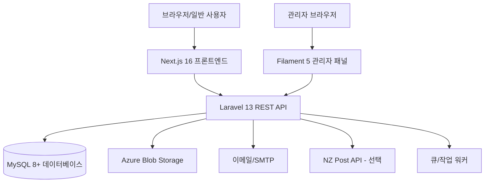

# 01 — 시스템 아키텍처

## 아키텍처 개요

OXP는 **분리된 API 우선 아키텍처**를 따릅니다. 백엔드는 RESTful JSON API를 제공하며, 프론트엔드가 이를 소비합니다. 관리자 패널은 백엔드와 함께 배포되는 서버 사이드 렌더링 Filament 애플리케이션입니다.



---

## 기술 스택

| 레이어 | 기술 | 버전 |
|---|---|---|
| 백엔드 프레임워크 | Laravel | 13 |
| 백엔드 언어 | PHP | 8.2+ |
| 관리자 패널 | Filament | 5 |
| 프론트엔드 프레임워크 | Next.js | 16 |
| 프론트엔드 언어 | TypeScript | 5.7 |
| UI 라이브러리 | React | 19 |
| CSS 프레임워크 | Tailwind CSS | 4.2 |
| 컴포넌트 기초 | Radix UI + shadcn/ui | 최신 |
| 리치 텍스트 편집기 | Tiptap | 최신 |
| 데이터베이스 | MySQL | 8+ |
| 스토리지 | Azure Blob Storage (또는 로컬) | — |
| 큐 | 데이터베이스 큐 (또는 Redis) | — |
| 인증 | Laravel Sanctum | — |

---

## 백엔드 구조 (`B2C_backend/`)

```
B2C_backend/
├── app/
│   ├── Enums/               # 22개 타입화된 열거형 (UserRole, OrderStatus 등)
│   ├── Filament/            # 관리자 패널 리소스 및 페이지
│   │   ├── Pages/           # 16개 독립형 관리자 페이지
│   │   └── Resources/       # 33+ CRUD 리소스 정의
│   ├── Http/
│   │   ├── Controllers/     # 50+ API 컨트롤러
│   │   └── Middleware/      # 요청 미들웨어
│   ├── Jobs/                # 백그라운드 작업
│   ├── Mail/                # 메일 클래스
│   ├── Models/              # 50+ Eloquent 모델
│   ├── Policies/            # 8개 권한 정책
│   └── Services/            # 25+ 비즈니스 로직 서비스 클래스
├── config/                  # Laravel 설정 파일
├── database/
│   ├── migrations/          # 73+ 데이터베이스 마이그레이션
│   └── seeders/             # 데모 데이터 시더
└── routes/
    ├── api.php              # REST API 라우트
    └── web.php              # 관리자 패널 + 미디어 서비스 라우트
```

---

## 프론트엔드 구조 (`B2C_frontend/`)

```
B2C_frontend/
├── src/
│   ├── app/                 # Next.js App Router
│   │   └── [locale]/        # 로케일 프리픽스 라우트 (en, ko, zh)
│   ├── components/          # React 컴포넌트
│   │   ├── account/         # 계정 페이지 컴포넌트
│   │   ├── community/       # 커뮤니티 기능 컴포넌트
│   │   ├── store/           # 스토어 및 결제 컴포넌트
│   │   ├── sections/        # 홈페이지 섹션 컴포넌트
│   │   └── ui/              # shadcn/ui 기본 컴포넌트
│   └── lib/
│       ├── api/             # 백엔드 API 클라이언트 모듈
│       ├── auth/            # 인증 상태 관리
│       ├── cart/            # 장바구니 상태 관리
│       ├── i18n.ts          # 국제화 설정
│       └── types.ts         # TypeScript 타입 정의
├── messages/
│   ├── en.json              # 영어 번역 (~95 KB)
│   ├── ko.json              # 한국어 번역 (~105 KB)
│   └── zh.json              # 중국어 번역 (~89 KB)
└── public/                  # 정적 에셋
```

### 라우팅

모든 공개 페이지는 언어 전환을 지원하기 위해 `[locale]` 세그먼트 아래에 중첩됩니다. 로케일은 URL 경로에서 확인되며 기본값은 `en`입니다.

예시:
- `/en/store` → 영어 스토어
- `/ko/community` → 한국어 커뮤니티
- `/zh/account/orders` → 중국어 주문 내역

인증은 **localStorage 토큰 저장** (`oxp.community.auth-token`)을 통해 Laravel Sanctum Bearer Token을 사용합니다.

---

## 관리자 패널 구조

관리자 패널은 `/admin` 경로 (백엔드 URL)에서 접근 가능하며, Filament 5로 구축되어 있습니다.

### 내비게이션 그룹

| 그룹 | 리소스/페이지 |
|---|---|
| **커뮤니티** | 게시물, 댓글, 신고, 모더레이션 로그, 사용자 위반, 관리자 행동 로그 |
| **사용자** | 사용자 관리 |
| **스토어** | 주문, 제품, 옵션, 카테고리, 이미지, 속성, 재고, 장바구니, 주소 |
| **CMS** | 소재, 소재 사양, 스토리 섹션, 활용 사례, 기사, 홈페이지 섹션, 아이디어 미디어 |
| **B2B/리드** | B2B 리드, 문의 |
| **이메일** | 이메일 템플릿, 이메일 이벤트, 이메일 로그 |
| **크라우드펀딩** | 펀딩 캠페인 |
| **커뮤니티 설정** | 카테고리, 태그 |
| **시스템** | 앱 설정, 기능 플래그, 커뮤니티 설정, 모더레이션 설정, 이메일 설정, 배송 설정, 세금 설정, 스토리지 설정, NZ Post 설정, 법적 페이지 설정, 설정 백업, 미디어 스토리지 스캔, 인수인계 준비, 데모 데이터 정리 |

---

## 데이터베이스 아키텍처

### 핵심 관계

| 테이블 | 용도 |
|---|---|
| `users` | 핵심 사용자 계정 (역할, 상태, 차단 플래그) |
| `profiles` | 확장 사용자 프로필 (소개, 아바타, 위치) |
| `posts` | 커뮤니티 게시물 (인게이지먼트 점수 포함) |
| `comments` | 중첩 댓글 (parent_id로 스레딩) |
| `products` | 제품 카탈로그 (다국어 콘텐츠) |
| `product_variants` | SKU 수준 옵션 (재고 수량 포함) |
| `orders` | 주문 (전체 상태 라이프사이클) |
| `order_items` | 제품 옵션에 연결된 주문 항목 |
| `app_settings` | 암호화된 런타임 설정 값 |
| `b2b_leads` | 구조화된 B2B 문의 레코드 |
| `reports` | 다형성 콘텐츠 신고 |
| `moderation_logs` | 관리자 모더레이션 감사 추적 |
| `email_templates` | 트랜잭션 이메일 템플릿 |

---

## 인증 및 권한 부여

### 역할 모델

| 역할 | 코드 | 권한 |
|---|---|---|
| **일반 사용자** | `creator` | 탐색, 게시, 댓글, 쇼핑, 신고 |
| **모더레이터** | `moderator` | 일반 사용자 모든 권한 + 신고 검토, 게시물/댓글 관리 |
| **관리자** | `admin` | 관리자 패널 완전 접근 |

### 계정 상태

| 상태 | 의미 |
|---|---|
| `active` | 정상 계정 |
| `suspended` | 일시 정지 — 로그인 불가 |
| `banned` | 영구 차단 |
| `restricted` | 로그인은 가능하지만 게시 또는 댓글 불가 |

---

## 스토리지 및 미디어

- **프로덕션 기본 디스크**: Azure Blob Storage (`azure` 드라이버)
- **파일 크기 제한**: 파일당 최대 10 MB
- **허용 유형**: 이미지 (jpg, jpeg, png, webp, gif), 문서 (pdf, doc, docx, ppt, pptx, xls, xlsx)
- **SAS URL**: Azure Blob Storage URL은 시간 제한 SAS 토큰 사용 (기본 TTL: 7일)

---

## i18n 아키텍처

### 프론트엔드
- 번역 파일: `B2C_frontend/messages/{locale}.json`
- 로케일 라우팅: Next.js App Router의 `[locale]` 세그먼트
- 빌드 시 검증: `check:i18n` 스크립트로 로케일 간 키 커버리지 검증

### 백엔드
- 다국어 콘텐츠 필드: 제품, 소재, 기사, 홈페이지 섹션, 카테고리 모두 지역화된 텍스트 열 포함 (예: `name_en`, `name_ko`, `name_zh`)
- 관리자 패널 언어 전환: `GET /admin/locale/{locale}`

---

*관련 코드: `B2C_backend/app/`, `B2C_frontend/src/`, `B2C_backend/routes/`*
