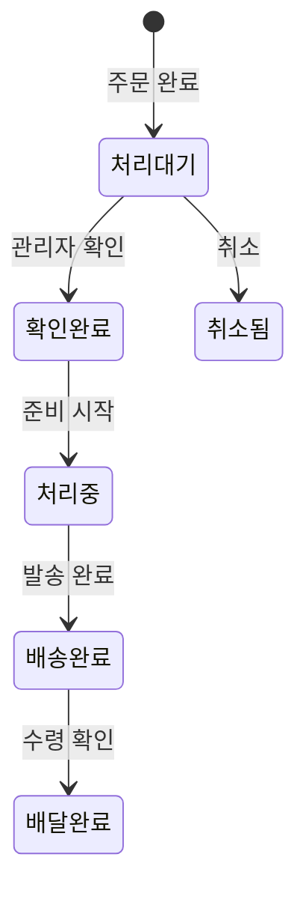

# 04 — 스토어 매뉴얼

## 개요

OXP 스토어는 제품 탐색, 장바구니 관리, 결제, 주문 추적을 지원하는 완전한 B2C 이커머스 모듈입니다. **비회원 결제**와 **회원 결제** 모두 지원합니다.

---

## 1. 제품 카탈로그

### 1.1 제품 데이터 구조

각 제품 필드:

**기본 정보**
- `name` — 다국어 (영어/한국어/중국어)
- `slug` — 고유 URL 식별자
- `status` — 활성, 비활성, 임시저장, 보관

**콘텐츠 필드**
- `description` — 리치 텍스트, 다국어
- `features` — 특징 목록, 다국어
- `care_instructions` — 관리 방법, 다국어
- `material_benefits` — 소재 장점, 다국어
- `certifications` — 인증 정보
- `shipping_notes` / `return_notes` — 다국어
- `product_faqs` — FAQ 항목 배열 (질문/답변, 다국어)

**커머스 필드**
- `price` — NZD 기준
- `compare_at_price` — 세일 표시용 정가
- `inquiry_only` — 문의 전용 모드
- `sample_request_enabled` — 소재 요청 활성화
- `is_featured` — 추천 제품

### 1.2 제품 카테고리

제품은 카테고리별로 구성됩니다. 카테고리는 다국어 이름, 고유 슬러그, 상위 카테고리를 지원합니다.

### 1.3 제품 옵션

각 제품에는 여러 옵션이 있을 수 있습니다. 재고는 옵션 수준에서 추적됩니다:

| 필드 | 설명 |
|---|---|
| `sku` | 재고 관리 코드 (고유) |
| `stock_quantity` | 현재 사용 가능한 재고 |
| `weight_grams` | 배송비 계산용 무게 |
| `barcode` | 바코드 (선택 사항) |

### 1.4 동적 제품 속성

세 테이블을 통해 유연한 속성 시스템 지원:
- `product_attribute_definitions` — 속성 유형 정의 (예: "색상", "크기")
- `product_attribute_values` — 속성 값 정의 (예: "빨간색", "중간")
- `product_attribute_assignments` — 제품과 속성 값 연결

---

## 2. 장바구니

### 2.1 장바구니 저장

- 각 로그인 사용자는 `carts` 테이블에 하나의 장바구니 레코드를 가집니다.
- 비회원 장바구니는 브라우저 세션에 저장됩니다.
- 비회원이 로그인하면 비회원 장바구니가 계정 장바구니에 병합됩니다 (`POST /api/cart/merge`).

### 2.2 재고 검증

제품을 담거나 수량을 변경할 때 요청 수량이 사용 가능 재고를 초과하는지 확인합니다.

---

## 3. 결제

### 3.1 배송비 옵션

**고정 요금 (기본값):**
- 일반 배송: `STORE_STANDARD_SHIPPING_RATE` (기본값: NZD 8)
- 빠른 배송: `STORE_EXPRESS_SHIPPING_RATE` (기본값: NZD 14)
- 농촌 지역 추가: `STORE_RURAL_SHIPPING_SURCHARGE` (기본값: NZD 5)
- 무료 배송 기준: `STORE_FREE_SHIPPING_THRESHOLD` (기본값: NZD 200)

**NZ Post 실시간 견적 (선택):**
`NZPOST_ENABLED=true`로 설정하고 자격증명을 설정하면 NZ Post에서 실시간 배송비를 가져옵니다.

### 3.2 세금 처리

- GST 세율: `STORE_GST_RATE` (기본값 15%)
- `STORE_PRICES_INCLUDE_GST=true`이면 제품 가격이 GST 포함 가격으로 표시됩니다.

### 3.3 결제 방법

> **중요**: OXP 플랫폼에는 결제 게이트웨이가 포함되어 있지 않습니다. 주문은 `payment_status`가 `unpaid`인 상태로 생성됩니다. 결제 처리는 운영자가 별도로 설정해야 합니다.

---

## 4. 주문 생성

주문 시 시스템이 자동으로:
1. 주문 번호 생성: `OXP-` + 6자리 무작위 영숫자
2. 배송 주소 스냅샷 저장
3. 배송비 견적 스냅샷 저장
4. 제품 옵션 가격 스냅샷으로 주문 항목 생성
5. 장바구니 비우기
6. 주문 상태를 "처리 대기 중"으로 설정

---

## 5. 주문 상태 라이프사이클

---

## 6. 재고 관리

- 재고는 **제품 옵션** 수준에서 추적됩니다.
- 주문 시 재고가 자동으로 차감되지 않습니다 — 관리자가 수동으로 업데이트해야 합니다.

> **권장 사항**: 주문 처리 후 정기적으로 재고를 수동으로 조정하는 프로세스를 수립하세요.

---

## 7. 현재 스토어 제한 사항

| 제한 사항 | 상세 내용 |
|---|---|
| 결제 게이트웨이 없음 | 주문 생성 시 결제 처리 없음; 수동 결제 확인 필요 |
| 수동 재고 관리 | 재고 수준은 관리자가 수동으로 업데이트해야 함 |
| 뉴질랜드 중심 배송 | NZ Post용으로 구축; 국제 배송 미설정 |
| 할인/쿠폰 없음 | 프로모션 할인 기능 없음 |
| 단일 통화 | NZD만 지원 |
| 제품 리뷰 없음 | 고객 리뷰 및 평점 시스템 없음 |

---

*관련 코드: `B2C_backend/app/Services/OrderService.php`, `B2C_backend/app/Services/CartService.php`*
