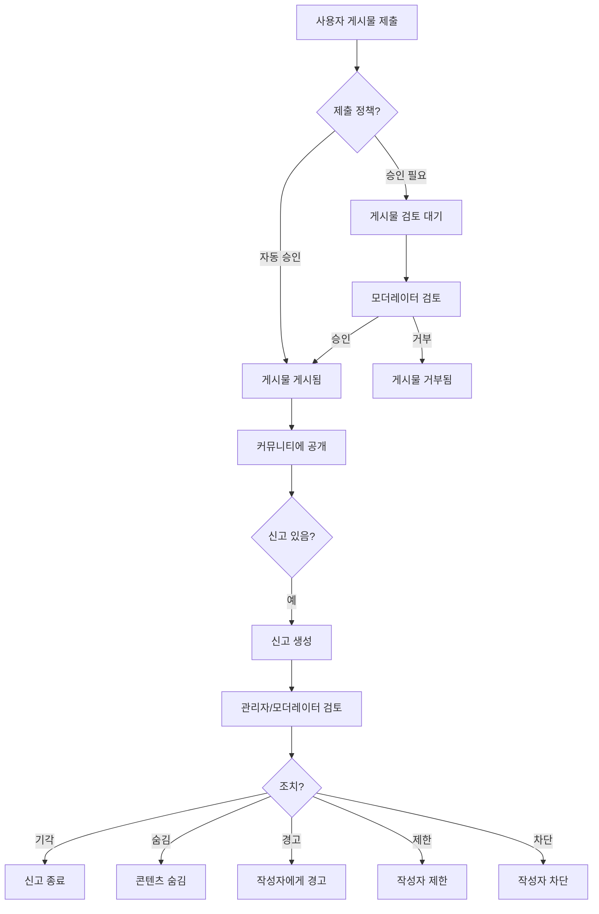

# 05 — 커뮤니티 매뉴얼

## 개요

OXP 커뮤니티는 등록 사용자가 지속 가능한 소재 및 디자인 분야의 아이디어, 프로젝트, 지식을 공유하는 사용자 생성 콘텐츠 플랫폼입니다.

---

## 1. 커뮤니티 목적

- 소재 혁신가와 디자이너 간의 지식 공유 장려
- 프로젝트 쇼케이스와 아이디어 발굴 공간 제공
- 팔로우 관계를 통한 커뮤니티 멤버 발견 지원
- 게시물에 연결된 크라우드펀딩 캠페인 지원
- 신고 및 모더레이션 시스템을 통한 콘텐츠 품질 유지

---

## 2. 게시물

### 2.1 게시물 필드

| 필드 | 필수 | 설명 |
|---|---|---|
| `title` | 예 | 게시물 제목 |
| `content` | 예 | 리치 텍스트 본문 (Tiptap JSON 형식으로 저장) |
| `cover_image` | 아니요 | 커버 이미지 |
| `category` | 아니요 | 게시물 카테고리 |
| `tags` | 아니요 | 여러 태그 |
| `reading_time` | 자동 | 예상 읽기 시간 (분) |
| `status` | 자동 | 임시저장/게시됨/검토 대기/보관/거부 |

### 2.2 제출 정책

플랫폼은 세 가지 제출 정책을 지원합니다 (관리자가 설정):

| 정책 | 동작 |
|---|---|
| **자동 승인** | 제출 후 즉시 게시 |
| **승인 필요** | 모더레이터 검토 후 승인 시 게시 |
| **제한됨** | 특정 사용자만 게시 가능 |

---

## 3. 미디어 첨부 (아이디어 미디어)

게시물에 다양한 미디어를 첨부할 수 있습니다:

- 게시물당 최대 **12개 파일** (이미지 및 문서)
- 게시물당 최대 **4개 외부 링크**
- 파일당 최대 **10 MB**
- 허용 이미지 유형: jpg, jpeg, png, webp, gif
- 허용 문서 유형: pdf, doc, docx, ppt, pptx, xls, xlsx

---

## 4. 상호작용

### 4.1 좋아요
- 게시물의 좋아요 아이콘을 클릭하여 좋아요
- 다시 클릭하면 취소
- 좋아요 수는 공개적으로 표시됨
- 좋아요는 게시물의 `engagement_score`에 기여

### 4.2 저장/즐겨찾기
- 북마크 아이콘 클릭으로 개인 저장 목록에 추가
- **계정 → 커뮤니티 → 저장됨**에서 접근 가능

### 4.3 댓글
- 모든 로그인 사용자가 게시된 게시물에 댓글 작성 가능
- **스레드형 답글** 지원 (parent_id를 통한 1단계 중첩)
- 댓글도 독립적으로 좋아요 가능

---

## 5. 팔로우 관계

- 사용자 프로필 페이지에서 **팔로우** 클릭
- 팔로워/팔로잉 수가 프로필에 표시됨
- `follows` 테이블 사용 (자기 참조: `follower_id` ↔ `following_id`)

---

## 6. 알림

사용자가 알림을 받는 경우:

| 알림 유형 | 트리거 |
|---|---|
| `post_like` | 누군가 게시물에 좋아요를 눌렀을 때 |
| `comment` | 누군가 게시물에 댓글을 달았을 때 |
| `comment_like` | 누군가 댓글에 좋아요를 눌렀을 때 |
| `follow` | 누군가 팔로우했을 때 |
| `report` | 신고한 콘텐츠가 처리되었을 때 |
| `system_announcement` | 관리자 시스템 공지 |

알림은 `CreateUserNotificationJob` 백그라운드 작업을 통해 비동기적으로 생성됩니다.

---

## 7. 크라우드펀딩 캠페인

게시물에 선택적으로 **펀딩 캠페인**을 연결할 수 있습니다:
- 캠페인은 게시물과 연결되어 지원 버튼을 표시
- 버튼 텍스트 설정 가능 (기본값: "Support this concept")
- 캠페인 상태: 활성, 비활성, 완료, 취소

> **현재 제한 사항**: 프론트엔드 캠페인 표시가 제한적입니다.

---

## 8. 게시물 랭킹

커뮤니티 게시물은 두 가지 점수로 순위가 매겨집니다:
- **인게이지먼트 점수** (`engagement_score`): 좋아요, 댓글, 저장, 조회 수 기반
- **트렌딩 점수** (`trending_score`): 최근 인게이지먼트의 시간 가중 조합

---

## 9. 콘텐츠 신고

1. 게시물 또는 댓글의 **더보기 메뉴 (⋮)**를 클릭합니다.
2. **신고**를 선택합니다.
3. 신고 이유를 선택합니다.
4. 제출합니다.

---

## 10. 모더레이션 흐름

---

## 11. 현재 커뮤니티 제한 사항

| 제한 사항 | 상세 내용 |
|---|---|
| 크라우드펀딩 프론트엔드 | 캠페인 진행 상황의 프론트엔드 표시 제한적 |
| 실시간 업데이트 없음 | 피드가 수동 새로 고침 없이 자동으로 업데이트되지 않음 |
| 직접 메시지 없음 | 사용자 간 개인 메시지 시스템 없음 |
| 게시물 예약 없음 | 게시물은 즉시 게시됨 (예약 없음) |

---

*관련 코드: `B2C_backend/app/Services/PostService.php`, `B2C_frontend/src/components/community/`*
