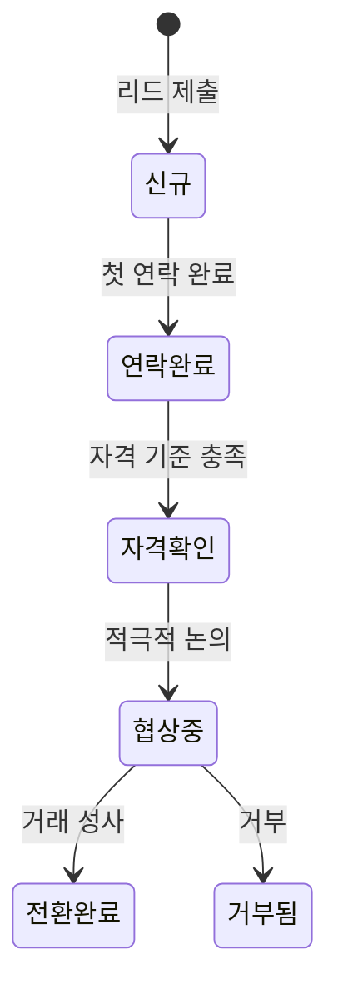

# 06 — B2B 및 문의 매뉴얼

## 개요

OXP 플랫폼은 비즈니스 문의, 파트너십 논의, 소재 요청, 협업을 위한 여러 채널을 제공합니다. 모든 제출 내용은 데이터베이스에 저장되고 관리자 패널을 통해 관리됩니다.

---

## 1. 문의 유형

| 양식 유형 | API 엔드포인트 | 데이터베이스 모델 | 목적 |
|---|---|---|---|
| 일반 문의 | `POST /api/inquiries` | `Inquiry` | 일반 연락/질문 |
| 비즈니스 연락 | `POST /api/business-contacts` | `Inquiry` | 비즈니스 파트너십 초기 연락 |
| B2B 문의 | `POST /api/partnership-inquiries` | `B2BLead` | 구조화된 B2B 리드 양식 |
| 대학 협업 | `POST /api/university-collaborations` | `PartnershipInquiry` | 학술/대학 파트너십 |
| 제품 개발 | `POST /api/product-development-collaborations` | `PartnershipInquiry` | 제품 개발 파트너십 |
| 소재 요청 | `POST /api/sample-requests` | `SampleRequest` | 제품 소재 요청 |

---

## 2. B2B 문의 양식 (사용자 측)

**프론트엔드 위치**: `/b2b` 또는 홈페이지 B2B 섹션에서 접근

### 2.1 양식 필드

**연락처 정보**: 이름, 이메일, 전화번호, 국가

**회사 정보**: 회사명, 규모 (소형/중형/대형), 업종, 연간 생산량

**문의 세부 사항**
- 리드 유형: 소재 문의 / 파트너십 / 소재 요청 / 협업
- 관심 유형: 도매 / 유통 / 제조 / 맞춤 생산 / 교육
- 메시지/설명

### 2.2 제출 후 처리

1. 새 `B2BLead` 레코드 생성, 상태 "신규"로 설정
2. `B2B_LEADS_NOTIFY_ADMINS=true`이면 알림 이메일 발송
3. 사용자에게 성공 메시지 표시

---

## 3. 관리자 검토 흐름

### 3.1 B2B 리드 보기

**위치**: 관리자 패널 → B2B/리드 → B2B 리드

### 3.2 리드 상태 파이프라인

### 3.3 리드 처리

1. 리드 레코드 열기
2. 제출된 정보 검토 (회사, 연락처, 관심 유형, 메시지)
3. 현재 진행 상황을 반영하도록 **상태** 업데이트
4. **담당자 배정** 필드 사용하여 팀원에게 배정
5. 내부 메모 추가

### 3.4 리드 내보내기

B2B 리드 목록에서 **내보내기** 버튼을 클릭하여 CSV 파일을 다운로드합니다.

---

## 4. 이메일 알림 설정

`B2B_LEADS_NOTIFY_ADMINS=true`일 때:
1. B2B 문의 제출 시 트리거
2. `B2BLeadSubmittedMail` 이메일 발송
3. `B2B_LEAD_NOTIFICATION_RECIPIENTS` (쉼표로 구분된 이메일 목록)으로 전송

---

## 5. 관리자 권장 워크플로우

1. **매일 확인** — 관리자 패널에서 새 B2B 리드 확인
2. **24~48시간 내 응답** — 전환율 극대화를 위해 신속히 연락
3. **리드 상태 업데이트** — 각 상호작용 후 상태 업데이트로 파이프라인 관리
4. **월별 내보내기** — CRM 동기화 및 판매 보고용 내보내기 수행
5. **이메일 알림 설정** — 영업팀이 새 제출 즉시 알림 받도록 설정
6. **담당자 배정** — 팀원 책임 추적을 위해 리드를 특정 팀원에게 배정

---

## 6. 현재 제한 사항

| 제한 사항 | 상세 내용 |
|---|---|
| 자동 CRM 동기화 없음 | 리드를 수동으로 내보내고 CRM에 가져와야 함 |
| 자동 점수 매기기 없음 | 모든 평가가 수동 |
| 이메일 답장 추적 없음 | 이메일 답장이 플랫폼 내에서 추적되지 않음 |

---

*관련 코드: `B2C_backend/app/Models/B2BLead.php`, `B2C_backend/app/Services/B2BLeadService.php`*
