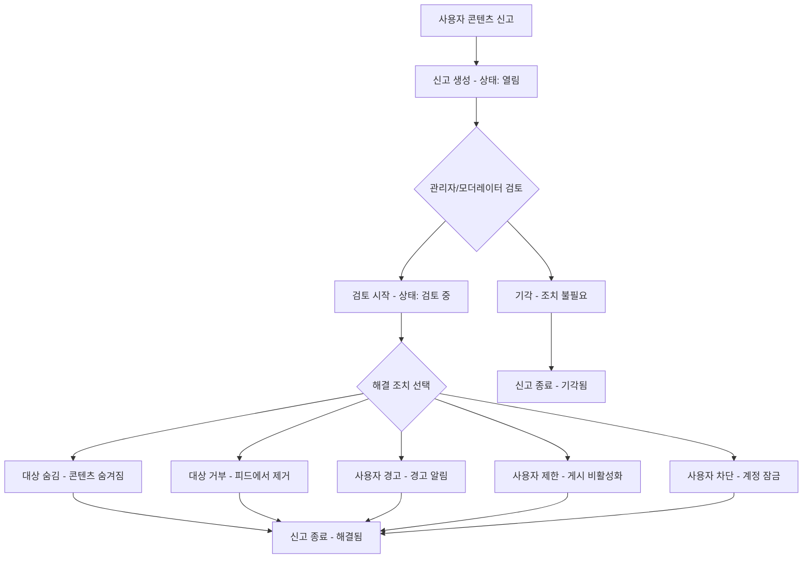

# 09 — 신고 검토 및 운영 관리

## 개요

OXP 플랫폼은 콘텐츠 품질과 사용자 안전을 유지하기 위한 종합적인 커뮤니티 모더레이션 시스템을 갖추고 있습니다. 이 매뉴얼은 신고 제출부터 해결까지의 전체 모더레이션 워크플로우를 다룹니다.

*관련 코드: `app/Services/ReportService.php`, `app/Services/AdminModerationService.php`, `app/Services/GovernanceService.php`*

---

## 1. 모더레이션 아키텍처

---

## 2. 신고 관리

### 2.1 신고 접근

**위치**: 관리자 패널 → 커뮤니티 → 신고

신고 목록에는 모든 콘텐츠 신고가 다음 정보와 함께 표시됩니다:
- 신고자 (사용자명)
- 대상 유형 (게시물 또는 댓글)
- 대상 콘텐츠 미리보기
- 신고 상태
- 제출 날짜

**사용 가능한 필터:**
- 상태: 열림 / 검토 중 / 해결됨 / 거부됨 / 기각됨
- 대상 유형: 게시물 / 댓글
- 날짜 범위

### 2.2 신고 필드

| 필드 | 설명 |
|---|---|
| `reporter` | 신고를 제출한 사용자 |
| `reportable_type` | 게시물 또는 댓글 |
| `reportable_id` | 신고된 항목의 ID |
| `status` | 열림 / 검토 중 / 해결됨 / 거부됨 / 기각됨 |
| `resolution_action` | 숨김 / 삭제 / 경고 / 제한 / 차단 (해결 시 설정) |
| `feedback` | 해결 후 신고자에게 표시되는 메시지 |
| `rejected_reason` | 신고가 거부된 이유 (콘텐츠가 문제없는 경우) |
| `resolved_at` | 해결 타임스탬프 |
| `feedback_given_at` | 신고자에게 피드백이 전송된 타임스탬프 |

*관련 코드: `app/Models/Report.php`, `app/Enums/ReportStatus.php`, `app/Enums/ReportResolutionAction.php`*

### 2.3 신고 처리 절차

1. 신고 목록에서 **신고를 엽니다**.
2. **콘텐츠를 검토합니다** — 신고된 게시물 또는 댓글 링크를 클릭합니다.
3. **맥락을 확인합니다** — 신고자의 이유와 전체적인 대화를 검토합니다.
4. 심각도에 따라 **조치를 취합니다**:

**콘텐츠가 가이드라인을 위반하지 않는 경우:**
- **기각**을 클릭합니다 — 조치 없이 신고가 종료됩니다.
- 선택적으로 신고자에게 피드백 메모를 제공합니다.

**콘텐츠가 가이드라인을 위반하는 경우:**
- **검토 시작**을 클릭하여 상태를 검토 중으로 변경합니다.
- 적절한 조치를 선택합니다:
  - **숨김** — 공개 피드에서 콘텐츠를 숨깁니다 (복구 가능)
  - **거부** — 콘텐츠를 거부됨으로 표시합니다 (숨김보다 강한 조치)
  - **사용자 경고** — 콘텐츠 작성자에게 경고 알림을 발송합니다
  - **사용자 제한** — 작성자가 게시물 또는 댓글 작성을 못하도록 합니다
  - **사용자 차단** — 작성자를 플랫폼에서 영구 차단합니다

---

## 3. 모더레이션 조치 참고

### 3.1 대상 숨김

- 게시물 또는 댓글이 공개 피드에서 보이지 않게 됩니다.
- 작성자는 자신의 콘텐츠를 여전히 볼 수 있습니다.
- 가장 경미한 조치이며 관리자가 되돌릴 수 있습니다.

### 3.2 대상 거부

- 콘텐츠가 거부됨으로 표시됩니다.
- 공개 피드에서 제거됩니다.
- 모더레이션 로그에 기록됩니다.

### 3.3 사용자 경고

- 콘텐츠 작성자에게 `system` 유형 알림이 발송됩니다.
- 콘텐츠 자체는 수정되지 않습니다.
- 관리자 설정에 따라 위반 레코드가 생성될 수 있습니다.
- 초범 또는 경미한 위반에 유용합니다.

### 3.4 사용자 제한

- 사용자의 `account_status`가 `restricted`로 변경됩니다.
- 사용자는 로그인하여 탐색할 수 있지만 게시물이나 댓글을 작성할 수 없습니다.
- 계정 상태를 활성으로 변경하여 복구할 수 있습니다.
- 반복적인 경미한 위반에 적합합니다.

### 3.5 사용자 차단

- 사용자의 `account_status`가 `banned`로 변경됩니다.
- 사용자가 로그인할 수 없습니다.
- 영구적인 조치이며 심각한 위반에만 사용해야 합니다.

*관련 코드: `app/Services/AdminModerationService.php`*

---

## 4. 모더레이션 큐

**위치**: 관리자 패널 → 커뮤니티 → 모더레이션 큐 (전용 페이지로 설정된 경우)

또는 신고 목록에서 **열림** 또는 **검토 중** 상태의 신고를 검토합니다.

### 4.1 일별 모더레이션 워크플로우

1. 신고 목록을 **열림** 상태로 필터링하여 엽니다.
2. 오래된 신고부터 순서대로 처리합니다.
3. 각 신고에 대해: 콘텐츠를 검토하고 조치를 선택하여 저장합니다.
4. 이전 날부터 팔로업이 필요한 **검토 중** 신고가 있는지 확인합니다.
5. 검토가 필요한 새로 가입한 사용자를 확인합니다 (제출 정책이 승인 필요로 설정된 경우).

---

## 5. 사용자 위반

**위치**: 관리자 패널 → 커뮤니티 → 사용자 위반

사용자 위반은 커뮤니티 가이드라인 위반의 공식 기록입니다. 신고 해결 과정에서 사용자가 경고, 제한 또는 차단을 받을 때 생성됩니다.

### 5.1 위반 필드

| 필드 | 설명 |
|---|---|
| `user` | 가이드라인을 위반한 사용자 |
| `violation_type` | 괴롭힘 / 혐오 발언 / 스팸 / 허위 정보 / 저작권 / 기타 |
| `severity` | 낮음 / 보통 / 높음 / 심각 |
| `status` | 활성 / 해결됨 / 이의 제기 중 |
| `description` | 위반 상세 내용 |
| `evidence` | 위반 콘텐츠 링크 |

### 5.2 위반 심각도 가이드

| 심각도 | 일반적인 조치 |
|---|---|
| 낮음 | 경고 |
| 보통 | 제한 (임시) |
| 높음 | 제한 (연장) 또는 차단 |
| 심각 | 즉시 차단 |

*관련 코드: `app/Models/UserViolation.php`, `app/Enums/UserViolationType.php`*

---

## 6. 모더레이션 로그

**위치**: 관리자 패널 → 커뮤니티 → 모더레이션 로그

모든 모더레이션 조치는 `moderation_logs` 테이블에 기록됩니다. 로그에는 다음이 표시됩니다:
- 어떤 관리자/모더레이터가 조치를 취했는지
- 대상 (게시물, 댓글 또는 사용자)
- 취한 조치
- 날짜 및 시간
- 기록된 메모

이를 통해 책임 소재 파악 및 분쟁 해결을 위한 감사 추적이 생성됩니다.

*관련 코드: `app/Models/ModerationLog.php`*

---

## 7. 관리자 행동 로그

**위치**: 관리자 패널 → 커뮤니티 → 관리자 행동 로그

플랫폼 전반의 모든 중요한 관리자 행동을 기록하는 광범위한 감사 로그입니다 (모더레이션만이 아닌):
- 설정 변경
- 사용자 역할 수정
- 콘텐츠 상태 변경
- 시스템 행동

*관련 코드: `app/Models/AdminActionLog.php`*

---

## 8. 게시물 및 댓글 직접 모더레이션 (신고와 독립적)

관리자는 신고를 기다리지 않고 콘텐츠를 직접 모더레이션할 수도 있습니다:

### 8.1 게시물 직접 모더레이션

**위치**: 관리자 패널 → 커뮤니티 → 게시물

- 게시물 상태를 **보관됨** 또는 **거부됨**으로 직접 변경
- **추천** 상태를 토글하여 게시물을 홍보하거나 낮춤
- **고정** 상태를 토글
- 게시물 내용 편집 (신중하게 수행하고 기록해야 함)

### 8.2 댓글 직접 모더레이션

**위치**: 관리자 패널 → 커뮤니티 → 댓글

- 댓글 상태를 **보관됨** 또는 **거부됨**으로 변경
- 댓글 삭제

### 8.3 사전 콘텐츠 검토

**승인 필요** 제출 정책을 사용하는 플랫폼의 경우:
1. 게시물 목록에서 상태를 **검토 대기 중**으로 필터링합니다.
2. 게시물 내용을 검토합니다.
3. 승인(게시됨으로 설정) 또는 거부합니다.

---

## 9. 커뮤니티 모더레이션 설정

**위치**: 관리자 패널 → 시스템 → 커뮤니티 모더레이션 설정

플랫폼 전체 모더레이션 정책을 설정합니다:

| 설정 | 옵션 | 효과 |
|---|---|---|
| 제출 정책 | 자동 승인 / 승인 필요 / 제한됨 | 새 게시물 처리 방식 제어 |
| 민감어 필터 | 활성화 / 비활성화 | 설정 가능한 단어 차단 목록 활성화 |
| 민감어 | 쉼표로 구분된 목록 | 콘텐츠 신고를 트리거하는 단어 |

*관련 코드: `app/Models/CommunityModerationSetting.php`, `app/Services/CommunityModerationPolicyService.php`*

---

## 10. 거버넌스 및 사용자 이력

**위치**: 관리자 API 엔드포인트를 통해 접근 (관리자 패널에서 접근 가능)

모든 사용자에 대해 관리자는 다음을 검토할 수 있습니다:
- **모더레이션 이력**: 이 사용자의 콘텐츠에 대해 취한 모든 모더레이션 조치
- **관리자 행동**: 이 사용자 계정에 대한 모든 관리자 주도 행동
- **위반**: 기록된 모든 위반

접근 경로:
- `GET /api/admin/users/{user}/moderation-history`
- `GET /api/admin/users/{user}/admin-actions`
- `GET /api/admin/users/{user}/violations`

*관련 코드: `app/Services/GovernanceService.php`, `app/Http/Controllers/Api/Admin/GovernanceController.php`*

---

## 11. 모더레이터 역할

`moderator` 역할을 가진 사용자는 모더레이션 기능에 접근할 수 있지만 전체 관리자 패널 접근 권한은 없습니다. 모더레이터는:
- 신고 검토 및 처리
- 게시물 및 댓글 상태 변경
- 사용자 경고, 제한 또는 차단

모더레이터가 **할 수 없는** 것:
- 제품/스토어 관리 접근
- 청구 또는 설정 접근
- 카테고리 생성 또는 삭제

모더레이터 역할 배정: **관리자 패널 → 사용자 → 사용자 → 사용자 편집 → 역할 → 모더레이터**.

---

## 12. 모더레이션 모범 사례

1. **일관성 유지**: 신고자나 콘텐츠 작성자에 관계없이 동일한 기준을 적용하세요.
2. **결정 사항 문서화**: 경계선상의 신고를 기각할 때 향후 참조를 위해 메모를 추가하세요.
3. **심각한 위반 에스컬레이션**: 위협, 불법 콘텐츠 또는 심각한 괴롭힘은 즉시 플랫폼 관리자에게 에스컬레이션하세요.
4. **차단 결정 검토**: 유명 계정 차단은 최소 두 명의 관리자가 검토해야 합니다.
5. **트렌드 모니터링**: 동일한 사용자가 여러 차례 경고를 받는 경우 제한으로 에스컬레이션하세요.
6. **신고자에게 응답**: 정책이 허용하는 경우 신고 결과에 대해 신고자에게 피드백을 제공하세요.
7. **모더레이션 로그 관리**: 모든 조치에는 결정 이유를 설명하는 메모가 있어야 합니다.

---

*관련 코드: `B2C_backend/app/Services/ReportService.php`, `B2C_backend/app/Services/AdminModerationService.php`, `B2C_backend/app/Filament/Resources/ReportResource.php`*
