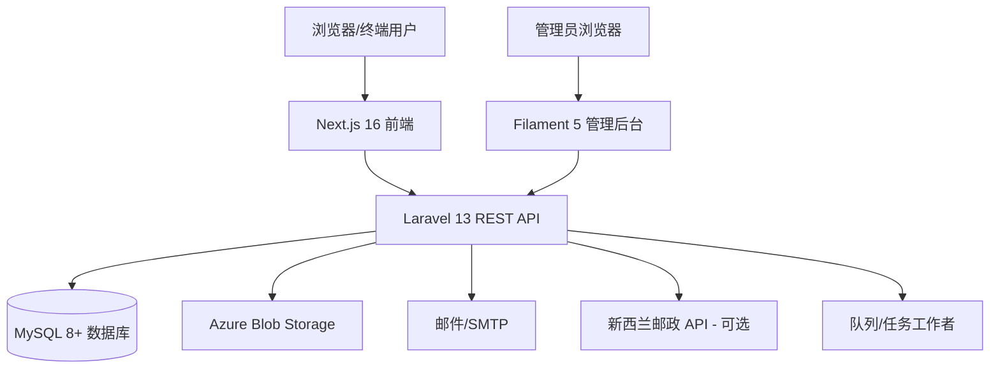
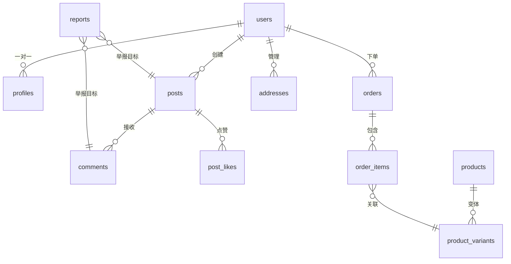
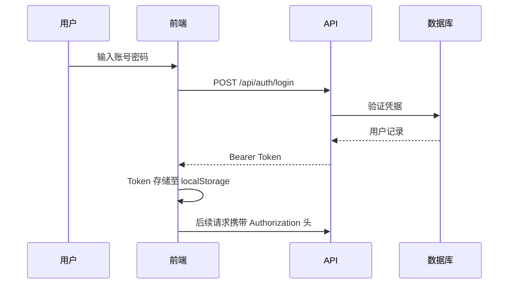

# 01 — 系统架构说明

## 架构概览

OXP 采用**前后端分离、API 优先**的架构。后端提供 RESTful JSON API，前端消费该 API。管理后台是基于 Filament 框架构建的服务端渲染应用，与后端共同部署。



---

## 技术栈

| 层级 | 技术 | 版本 |
|---|---|---|
| 后端框架 | Laravel | 13 |
| 后端语言 | PHP | 8.2+ |
| 管理后台 | Filament | 5 |
| 前端框架 | Next.js | 16 |
| 前端语言 | TypeScript | 5.7 |
| UI 库 | React | 19 |
| CSS 框架 | Tailwind CSS | 4.2 |
| 组件基础库 | Radix UI + shadcn/ui | 最新版 |
| 富文本编辑器 | Tiptap | 最新版 |
| 数据库 | MySQL | 8+ |
| 文件存储 | Azure Blob Storage（或本地） | — |
| 队列 | 数据库队列（或 Redis） | — |
| 缓存 | 数据库缓存（或 Redis） | — |
| 身份认证 | Laravel Sanctum | — |
| 表单验证 | Zod（前端）+ Laravel 验证器 | — |

---

## 后端结构（`B2C_backend/`）

```
B2C_backend/
├── app/
│   ├── Enums/               # 22 个类型化枚举（UserRole、OrderStatus 等）
│   ├── Filament/            # 管理后台资源和页面
│   │   ├── Pages/           # 16 个独立后台页面
│   │   └── Resources/       # 33+ CRUD 资源定义
│   ├── Http/
│   │   ├── Controllers/     # 50+ API 控制器
│   │   └── Middleware/      # 请求中间件
│   ├── Jobs/                # 后台任务（CreateUserNotificationJob）
│   ├── Mail/                # 邮件类
│   ├── Models/              # 50+ Eloquent 模型
│   ├── Policies/            # 8 个授权策略
│   └── Services/            # 25+ 业务逻辑服务类
├── config/                  # Laravel 配置文件
├── database/
│   ├── migrations/          # 73+ 数据库迁移
│   └── seeders/             # 初始内容填充
├── routes/
│   ├── api.php              # 所有 REST API 路由
│   └── web.php              # 管理后台 + 媒体服务路由
└── storage/                 # 文件存储（本地磁盘或链接）
```

### 关键设计决策

- **服务层**：所有业务逻辑封装在 `app/Services/` 中，控制器轻薄，仅做调度。
- **策略授权**：路由中间件（`auth:sanctum`、`role:admin`、`role:moderator`）和 Eloquent 策略共同控制访问权限。
- **类型化枚举**：所有状态值和角色类型使用 PHP 8.1+ backed enum，保证类型安全。
- **设置系统**：运行时配置存储在 `app_settings` 数据库表（加密），无需重新部署即可更改配置。

---

## 前端结构（`B2C_frontend/`）

```
B2C_frontend/
├── src/
│   ├── app/                 # Next.js App Router
│   │   └── [locale]/        # 带语言前缀的路由（en、ko、zh）
│   ├── components/          # React 组件
│   │   ├── account/         # 账号页面组件
│   │   ├── community/       # 社区功能组件
│   │   ├── store/           # 商城和结账组件
│   │   ├── sections/        # 首页板块组件
│   │   └── ui/              # shadcn/ui 基础组件
│   └── lib/
│       ├── api/             # 后端 API 客户端模块
│       ├── auth/            # 认证状态管理
│       ├── cart/            # 购物车状态管理
│       ├── i18n.ts          # 国际化配置
│       └── types.ts         # TypeScript 类型定义
├── messages/
│   ├── en.json              # 英文翻译（~95 KB）
│   ├── ko.json              # 韩文翻译（~105 KB）
│   └── zh.json              # 中文翻译（~89 KB）
└── public/                  # 静态资源
```

### 路由设计

所有公开页面嵌套在 `[locale]` 路由段下，实现多语言切换。语言从 URL 路径解析，默认为 `en`。

参考：
- `/en/store` → 英文商城
- `/ko/community` → 韩文社区
- `/zh/account/orders` → 中文订单历史

认证通过 **localStorage Token 存储**（`oxp.community.auth-token`）实现，使用 Laravel Sanctum Bearer Token。

---

## 管理后台结构

管理后台通过 `/admin` 路径访问（后端 URL），基于 Filament 5 构建。

### 导航分组

| 分组 | 资源/页面 |
|---|---|
| **社区** | 帖子、评论、举报、审核日志、用户违规、管理员操作日志 |
| **用户** | 用户管理 |
| **商城** | 订单、产品、变体、分类、图片、属性、库存、购物车、地址 |
| **CMS** | 材料、材料规格、故事章节、应用场景、文章、首页板块、创意媒体 |
| **B2B/线索** | B2B 线索、询盘 |
| **邮件** | 邮件模板、邮件事件、邮件日志 |
| **众筹** | 众筹活动 |
| **社区设置** | 分类、标签 |
| **系统** | 应用设置、功能开关、社区设置、审核设置、邮件设置、运费设置、税率设置、存储设置、新西兰邮政设置、法律页面设置、设置备份、媒体存储扫描、交付就绪检查、初始内容清除 |

---

## 数据库架构

### 核心关系



### 关键数据表

| 表名 | 用途 |
|---|---|
| `users` | 核心用户账号（角色、状态、封禁标志） |
| `profiles` | 扩展用户资料（简介、头像、地址） |
| `posts` | 社区帖子（含互动评分） |
| `comments` | 嵌套评论（通过 parent_id 实现层级） |
| `products` | 商品目录（含多语言内容） |
| `product_variants` | SKU 级变体（含库存数量） |
| `orders` | 订单（完整状态生命周期） |
| `order_items` | 关联商品变体的订单行项 |
| `carts` / `cart_items` | 购物车状态 |
| `materials` | 材料库（多语言内容） |
| `articles` | 知识库文章 |
| `home_sections` | 可配置的首页板块 |
| `app_settings` | 加密的运行时配置值 |
| `b2b_leads` | 结构化 B2B 询盘记录 |
| `reports` | 多态内容举报 |
| `moderation_logs` | 审核操作审计记录 |
| `email_templates` | 邮件事务模板 |
| `email_logs` | 邮件发送记录 |

---

## 认证与授权

### 认证流程



### 角色模型

| 角色 | 代码 | 权限 |
|---|---|---|
| **普通用户** | `creator` | 浏览、发帖、评论、购物、举报 |
| **版主** | `moderator` | 普通用户全部权限 + 审核举报、管理帖子/评论 |
| **管理员** | `admin` | 完整后台访问权限 |

### 账号状态

| 状态 | 含义 |
|---|---|
| `active` | 正常账号 |
| `suspended` | 临时停用，无法登录 |
| `banned` | 永久封禁 |
| `restricted` | 可登录但无法发帖或评论 |

---

## 服务类（核心业务逻辑）

| 服务 | 职责 |
|---|---|
| `AuthService` | 注册、登录、密码重置、邮箱验证 |
| `PostService` | 帖子 CRUD、状态流转、内容验证 |
| `CommentService` | 评论管理和层级结构 |
| `InteractionService` | 点赞、收藏、关注 |
| `NotificationService` | 通知创建与发送 |
| `PostRankingService` | 互动分和热度分计算 |
| `SearchService` | 帖子、材料、文章全文搜索 |
| `ReportService` | 内容举报提交和解决流程 |
| `AdminModerationService` | 管理员审核操作（隐藏、警告、限制、封禁） |
| `GovernanceService` | 用户违规记录和治理审计 |
| `OrderService` | 订单创建、状态更新、游客订单查询 |
| `CartService` | 购物车管理、商品操作、购物车合并 |
| `ProductCatalogService` | 商品列表、筛选和搜索 |
| `MediaService` | 文件上传、验证和删除 |
| `B2BLeadService` | B2B 线索资质评估和状态管理 |

---

## 文件存储与媒体

- **生产默认磁盘**：Azure Blob Storage（`azure` 驱动）
- **社区上传**：`COMMUNITY_UPLOAD_DISK`（默认与 `FILESYSTEM_DISK` 相同）
- **本地开发备选**：`public` 磁盘，需运行 `php artisan storage:link`
- **SAS URL**：Azure Blob Storage URL 使用有时限 SAS Token（默认有效期：7 天）
- **文件大小限制**：每个文件最大 10 MB（通过 `IDEA_MEDIA_MAX_FILE_SIZE_KB` 配置）
- **允许的文件类型**：图片（jpg、jpeg、png、webp、gif）、文档（pdf、doc、docx、ppt、pptx、xls、xlsx）

---

## 邮件系统

平台内置完整邮件中心：
- **邮件模板**：存储在 `email_templates` 表，支持多语言内容
- **邮件事件**：定义在 `email_events` 表（如 `order_confirmed`、`post_published`）
- **邮件日志**：所有已发邮件记录在 `email_logs`
- **邮件驱动**：通过 `MAIL_MAILER` 环境变量配置（开发环境默认 `log`）

---

## 国际化（i18n）架构

### 前端
- 翻译文件：`B2C_frontend/messages/{locale}.json`
- 语言路由：Next.js App Router 的 `[locale]` 路由段
- 构建时验证：`check:i18n` 脚本检查各语言翻译键的覆盖情况

### 后端
- 多语言内容字段：产品、材料、文章、首页板块、分类均包含本地化文本列（如 `name_en`、`name_ko`、`name_zh`）
- API 响应语言根据请求头或查询参数选择
- 管理后台语言切换：`GET /admin/locale/{locale}`

---

*相关代码：`B2C_backend/app/`、`B2C_frontend/src/`、`B2C_backend/routes/`*
