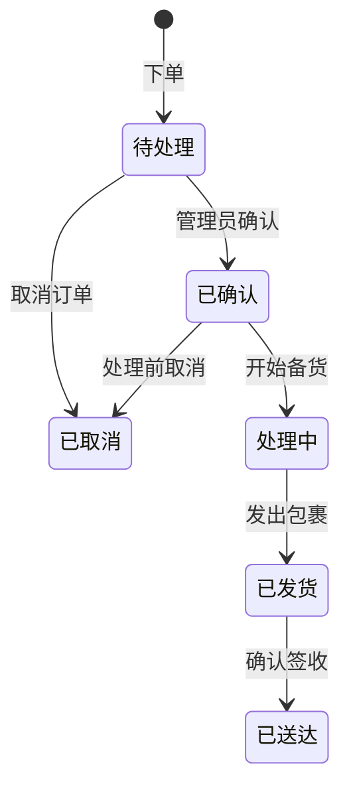

# 04 — 商城使用说明

## 概述

OXP 商城提供完整的 B2C 电商功能，支持商品浏览、购物车管理、结账和订单追踪。同时支持**游客结账**和**注册用户结账**两种方式。

---

## 1. 商品目录

### 1.1 商品数据结构

每个商品包含以下字段：

**身份信息**
- `name` — 多语言（英/韩/中）
- `slug` — 唯一 URL 标识符
- `status` — 上架、下架、草稿、存档

**内容字段**
- `description` — 富文本描述，多语言
- `features` — 特性列表，多语言
- `care_instructions` — 护理说明，多语言
- `material_benefits` — 材料优点，多语言
- `certifications` — 认证信息
- `shipping_notes` — 配送说明，多语言
- `return_notes` — 退货说明，多语言
- `product_faqs` — FAQ 列表（问题/答案，多语言）

**商务字段**
- `price` — 以新西兰元（NZD）计
- `compare_at_price` — 促销对比原价
- `inquiry_only` — 仅询价模式
- `sample_request_enabled` — 启用材料申请
- `is_featured` — 精选商品

**SEO 字段** — 标题和描述（多语言）

### 1.2 商品分类

商品按分类组织，分类支持：
- 多语言名称（英/韩/中）
- 唯一别名（Slug）
- 父分类（支持层级结构）

### 1.3 商品变体

每个商品可有多个变体（如不同规格），库存在变体级别追踪：

| 字段 | 说明 |
|---|---|
| `sku` | 商品编号（唯一） |
| `stock_quantity` | 当前可用库存 |
| `weight_grams` | 包裹重量（用于运费计算） |
| `barcode` | 条形码（可选） |

### 1.4 动态商品属性

平台通过三张数据表支持灵活的属性体系：
- `product_attribute_definitions` — 定义属性类型（如"颜色"、"尺寸"）
- `product_attribute_values` — 定义属性值（如"红色"、"中号"）
- `product_attribute_assignments` — 关联商品与其属性值

---

## 2. 购物车

### 2.1 购物车存储

- 每位登录用户在 `carts` 表中拥有一条购物车记录
- 游客购物车存储在浏览器会话中
- 游客登录后，游客购物车会通过 `POST /api/cart/merge` 合并至账号购物车

### 2.2 库存验证

添加商品或更新购物车时，系统检查所请求数量是否超出可用库存。库存不足时返回错误提示。

---

## 3. 结账流程

### 3.1 游客结账

1. 用户填写**邮箱地址**（用于订单确认和追踪）。
2. 填写收货地址。
3. 选择运费方式。
4. 提交订单。

游客可通过订单编号 + 邮箱地址在 `/store/orders` 查询订单。

### 3.2 运费计算

**固定费率模式（默认）：**
- 标准运费：`STORE_STANDARD_SHIPPING_RATE`（默认 NZD 8）
- 快递运费：`STORE_EXPRESS_SHIPPING_RATE`（默认 NZD 14）
- 乡村附加费：`STORE_RURAL_SHIPPING_SURCHARGE`（默认 NZD 5）
- 免运费门槛：`STORE_FREE_SHIPPING_THRESHOLD`（默认 NZD 200）

**新西兰邮政实时报价（可选）：**
当 `NZPOST_ENABLED=true` 并配置凭据后，从新西兰邮政获取实时运费报价。

### 3.3 税费处理

- GST 税率：`STORE_GST_RATE`（默认 15%）
- `STORE_PRICES_INCLUDE_GST=true` 时，商品价格含税显示
- 税额在订单中单独记录

### 3.4 支付说明

> **重要提示**：OXP 平台当前未接入支付网关。订单以"未支付"状态创建，需运营方手动确认付款。

---

## 4. 订单创建

下单时系统自动：
1. 生成订单编号（`OXP-` + 6位随机字母数字）
2. 保存收货地址快照
3. 保存运费报价快照
4. 按商品变体当前价格创建订单明细
5. 清空购物车
6. 订单状态设为"待处理"

---

## 5. 订单状态生命周期

---

## 6. 库存说明

- 库存在**商品变体**级别追踪
- 下单后库存**不会自动扣减**——需管理员在后台手动调整
- `InventoryAdjustment` 模型记录手动库存变更（含备注）

> **建议**：建立定期盘库流程，每次发货后手动更新库存数量。

---

## 7. 商城当前限制

| 限制 | 说明 |
|---|---|
| 无支付网关 | 订单创建后需人工确认付款 |
| 库存需手动管理 | 库存数量需管理员手动更新 |
| 仅新西兰运费 | 专为新西兰邮政设计，不支持国际运费 |
| 无折扣/优惠码 | 暂不支持促销折扣功能 |
| 单一货币 | 仅支持新西兰元（NZD） |
| 无商品评价 | 暂不支持用户评价和评分 |

---

*相关代码：`B2C_backend/app/Services/OrderService.php`、`B2C_backend/app/Services/CartService.php`*
