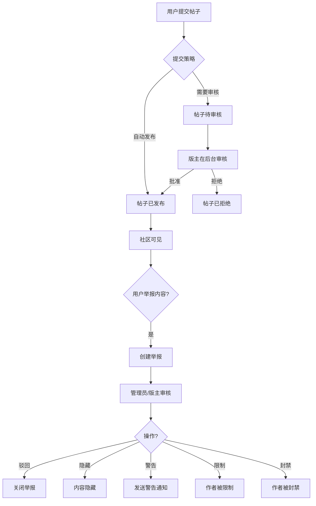

# 05 — 社区使用说明

## 概述

OXP 社区是一个用户原创内容平台，注册用户可分享可持续材料与设计领域的创意、项目和知识，类似专业社交发布平台。

---

## 1. 社区目的

- 鼓励材料创新者和设计师之间的知识共享
- 提供项目展示和创意孵化空间
- 通过关注关系实现社区成员发现
- 支持帖子关联众筹活动
- 通过举报和审核体系维护内容质量

---

## 2. 社区帖子

### 2.1 帖子字段

| 字段 | 必填 | 说明 |
|---|---|---|
| `title` | 是 | 帖子标题 |
| `content` | 是 | 富文本正文（Tiptap JSON 格式存储） |
| `cover_image` | 否 | 封面图片 |
| `category` | 否 | 帖子分类 |
| `tags` | 否 | 多个标签 |
| `reading_time` | 自动 | 预计阅读时间（分钟） |
| `status` | 自动 | 草稿/发布/待审核/存档/拒绝 |

### 2.2 提交策略

平台支持三种帖子提交策略（由管理员配置）：

| 策略 | 行为 |
|---|---|
| **自动发布** | 提交后立即公开 |
| **需要审核** | 进入"待审核"状态，版主批准后发布 |
| **限制发布** | 仅特定用户可发布 |

---

## 3. 媒体附件（创意媒体）

帖子可添加丰富的媒体附件（存储在 `idea_media` 表）：

- 每帖最多 **12 个文件**（图片和文档）
- 每帖最多 **4 个外部链接**
- 单文件最大 **10 MB**
- 支持图片类型：jpg、jpeg、png、webp、gif
- 支持文档类型：pdf、doc、docx、ppt、pptx、xls、xlsx

---

## 4. 互动功能

### 4.1 点赞

- 点击点赞图标为帖子点赞，再次点击取消
- 点赞数公开显示
- 点赞计入帖子的互动评分

### 4.2 收藏

- 点击书签图标将帖子保存至个人收藏
- 在**账号 → 社区 → 已收藏**查看收藏内容

### 4.3 评论

- 任何登录用户可对已发布帖子评论
- 支持**嵌套回复**（通过 `parent_id` 实现一级嵌套）
- 评论可独立点赞

---

## 5. 关注关系

- 点击用户公开主页上的**关注**按钮关注该用户
- 关注/被关注数量在用户主页显示
- 通过 `follows` 表实现（自引用：`follower_id` ↔ `following_id`）

---

## 6. 通知系统

以下操作触发站内通知：

| 通知类型 | 触发条件 |
|---|---|
| 点赞帖子 | 有人点赞了您的帖子 |
| 评论帖子 | 有人评论了您的帖子 |
| 点赞评论 | 有人点赞了您的评论 |
| 关注 | 有人关注了您 |
| 举报反馈 | 您的内容举报已处理 |
| 系统公告 | 管理员发布的全平台通知 |

通知通过 `CreateUserNotificationJob` 后台任务异步创建，通过导航栏的**通知铃铛**查看。

---

## 7. 众筹活动

帖子可关联**众筹活动**：
- 活动显示支持按钮（文本可配置）
- 活动包含多语言标题、描述和按钮文本
- 活动状态：进行中、已停止、已完成、已取消

> **当前限制**：后端数据模型和管理后台功能完整，但前台众筹活动展示有限。

---

## 8. 帖子排名

社区帖子通过两个评分排名：

- **互动评分**（`engagement_score`）：基于点赞、评论、收藏和浏览量
- **热度评分**（`trending_score`）：基于近期互动的时间加权组合

---

## 9. 内容举报

1. 点击帖子或评论的**三点菜单（⋮）**
2. 选择**举报**
3. 选择举报原因
4. 提交举报

举报由版主和管理员在后台审核处理。

---

## 10. 用户公开主页

访问 `/community/profile/{用户名}` 查看公开主页，显示：
- 显示名称、用户名、头像
- 个人简介和所在地
- 认证徽章（如 `is_verified` = true）
- 关注/被关注数量
- 用户已发布帖子

---

## 11. 审核流程

---

## 12. 账号限制说明

| 状态 | 限制 |
|---|---|
| 受限用户 | 可登录和浏览，但无法发帖、评论或互动 |
| 暂停用户 | 无法登录 |
| 封禁用户 | 永久锁定，无法登录 |

---

## 13. 社区当前限制

| 限制 | 说明 |
|---|---|
| 众筹前台展示有限 | 活动进度前台显示功能有限 |
| 无实时更新 | 动态流不自动刷新 |
| 无私信功能 | 不支持用户间私信 |
| 无帖子定时发布 | 帖子立即发布，不支持预约 |

---

*相关代码：`B2C_backend/app/Services/PostService.php`、`B2C_frontend/src/components/community/`*
