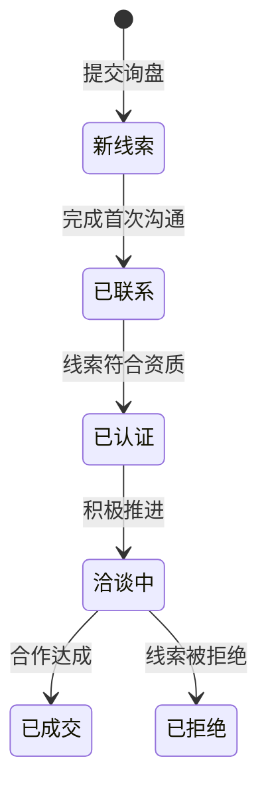

# 06 — B2B 与联系表单说明

## 概述

OXP 平台提供多种商务询盘渠道，包括通用联系表单、结构化 B2B 询盘、合作伙伴询盘和样品申请。所有提交记录保存至数据库，并通过管理后台进行管理。

---

## 1. 询盘类型

| 表单类型 | API 端点 | 数据库模型 | 用途 |
|---|---|---|---|
| 通用询盘 | `POST /api/inquiries` | `Inquiry` | 一般联系/问题咨询 |
| 商务联系 | `POST /api/business-contacts` | `Inquiry` | 初步商务联系 |
| B2B 询盘 | `POST /api/partnership-inquiries` | `B2BLead` | 结构化 B2B 线索表单 |
| 高校合作 | `POST /api/university-collaborations` | `PartnershipInquiry` | 学术/高校合作 |
| 产品研发合作 | `POST /api/product-development-collaborations` | `PartnershipInquiry` | 产品研发合作 |
| 样品申请 | `POST /api/sample-requests` | `SampleRequest` | 申请产品样品 |

---

## 2. B2B 询盘表单（用户端）

**前端位置**：`/b2b` 或从首页 B2B 版块进入。

### 2.1 表单字段

**联系信息**
- 名字和姓氏
- 邮箱地址
- 电话（可选）
- 国家/地区

**公司信息**
- 公司名称
- 公司规模（小型 <50 / 中型 50-500 / 大型 500+）
- 所属行业
- 年生产量（如适用）

**询盘详情**
- 线索类型：材料询盘 / 合作伙伴 / 样品申请 / 合作研发
- 兴趣类型：批发 / 分销 / 生产制造 / 定制生产 / 培训
- 需求描述

### 2.2 提交后处理

1. 创建 `B2BLead` 记录，状态为"新线索"。
2. 若 `B2B_LEADS_NOTIFY_ADMINS=true`，向 `B2B_LEAD_NOTIFICATION_RECIPIENTS` 发送邮件通知。
3. 向用户显示提交成功消息。

---

## 3. 联系表单（用户端）

**前端位置**：`/contact`

简单的通用联系表单：
- 姓名
- 邮箱地址
- 主题
- 留言内容

提交记录存储为 `Inquiry` 记录，在管理后台**B2B/线索 → 询盘**中可见。

---

## 4. 后台数据存储

| 模型 | 数据表 | 说明 |
|---|---|---|
| `Inquiry` | `inquiries` | 通用联系和商务询盘 |
| `B2BLead` | `b2b_leads` | 含完整资质数据的结构化 B2B 线索 |
| `PartnershipInquiry` | `partnership_inquiries` | 合作和协作申请 |
| `SampleRequest` | `sample_requests` | 样品申请 |

`B2BLead` 模型含有最丰富的数据结构，包括公司规模、行业、生产量、线索类型、兴趣类型和状态跟踪。

---

## 5. 管理后台审核流程

### 5.1 查看 B2B 线索

**位置**：管理后台 → B2B/线索 → B2B 线索

线索列表显示：
- 公司名称和联系信息
- 线索类型和兴趣类型
- 状态（新线索/已联系/已认证/洽谈中/已成交/已拒绝）
- 提交日期

### 5.2 线索状态流程



### 5.3 处理线索步骤

1. 打开线索记录
2. 审核提交信息（公司、联系人、兴趣类型、需求描述）
3. 更新**状态**反映当前跟进阶段
4. 使用**分配给**字段将线索指派给团队成员
5. 添加内部备注
6. 保存更改

### 5.4 导出线索

点击**导出**按钮下载 CSV 文件，可用于 CRM 导入或报表制作。

---

## 6. 邮件通知配置

当 `B2B_LEADS_NOTIFY_ADMINS=true` 时：
1. 提交 B2B 询盘后触发
2. 发送 `B2BLeadSubmittedMail` 邮件
3. 收件人为 `B2B_LEAD_NOTIFICATION_RECIPIENTS`（逗号分隔的邮箱列表）

配置方式：在 `.env` 中设置：
```
B2B_LEADS_NOTIFY_ADMINS=true
B2B_LEAD_NOTIFICATION_RECIPIENTS=admin@yourcompany.com,sales@yourcompany.com
```

---

## 7. 管理员推荐工作流程

1. **每日检查**管理后台的新 B2B 线索。
2. **48小时内回复**以提高转化率。
3. **及时更新线索状态**保持销售管道清晰。
4. **每月导出**线索进行销售报表和 CRM 同步。
5. **配置邮件通知**让销售团队第一时间收到新询盘提醒。
6. **分配负责人**确保追责明确。

---

## 8. 当前限制

| 限制 | 说明 |
|---|---|
| 无 CRM 自动同步 | 需手动导出并导入 CRM |
| 无线索评分 | 无自动资质评分，全靠人工判断 |
| 无邮件回复追踪 | 回复邮件不在平台内追踪 |
| 内部备注简单 | 仅支持单文本字段备注 |

---

*相关代码：`B2C_backend/app/Models/B2BLead.php`、`B2C_backend/app/Services/B2BLeadService.php`*
